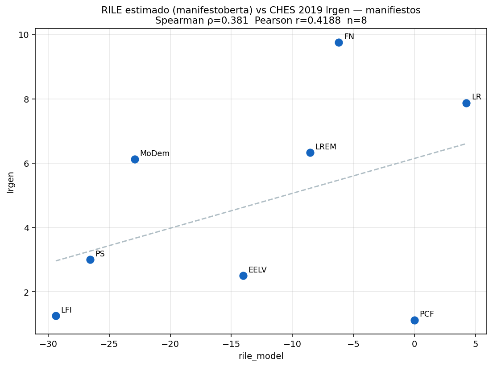

# Validación externa contra CHES — posiciones izquierda-derecha del corpus francés (XV legislatura)

Este módulo valida las clasificaciones MARPOR del proyecto (las que produce [`manifestoberta_analysis/`](../manifestoberta_analysis/)) contra un **benchmark externo e independiente**: el [Chapel Hill Expert Survey (CHES)](https://www.chesdata.eu/), una encuesta de expertos sobre las posiciones de los partidos europeos.

La pregunta que responde: *¿las posiciones izquierda-derecha que estimo desde el texto coinciden con dónde los expertos ubican a los partidos?* Si coinciden, es evidencia fuerte de que el pipeline mide lo que dice medir.

El módulo valida el pipeline sobre los **manifiestos**, que son el único canal con codificación humana de referencia (`cmp_code`): eso permite medir contra un techo realista y confirmar que el RILE estimado desde texto es correcto a nivel partido.

## Por qué CHES y no RILE

Para ubicar partidos en un eje izquierda-derecha hay dos varas posibles:

- **RILE** (el índice estándar de MARPOR): se calcula sumando/restando categorías MARPOR. Útil, pero **no es validación externa**: se construye con el mismo esquema que ya usa nuestro clasificador, así que comparar contra RILE es chequear consistencia interna (MARPOR vs MARPOR).
- **CHES**: encuesta a ~420 politólogos sobre las posiciones de los partidos. Otro mecanismo, otra fuente → **genuinamente externo**. Es la validación que sugirió Franziska.

Usamos **ambos**: RILE como el score que derivamos del texto, y CHES `lrgen` (0 = extrema izquierda, 10 = extrema derecha) como la vara externa contra la cual correlacionarlo.

## Datos

| Insumo | Origen | Qué aporta |
|---|---|---|
| Predicciones MARPOR | `manifestoberta_analysis/manifestos/results/predictions.csv` | un `top1_code` (modelo) y un `cmp_code` (humano) por quasi-frase |
| RILE oficial | `manifestos/processed/party_positions.csv` | el RILE publicado por MARPOR por partido (sanity check) |
| CHES 2019 | `data/CHES2019V3.csv` (descargado de chesdata.eu) | `lrgen`, `lrecon`, `galtan` por partido francés |

CHES 2019 cubre 8 de los 10 partidos del corpus de manifiestos. **PRG y UDI no están en CHES 2019**, así que entran al cálculo de RILE pero quedan fuera de la correlación.

## Cómo se calcula el RILE

Implementado en [`common/rile.py`](common/rile.py). Para cada partido se cuenta cuántas quasi-frases caen en cada categoría MARPOR y se aplica la fórmula estándar (Laver & Budge, 1992):

```
RILE = Σ(% categorías de derecha) − Σ(% categorías de izquierda)
```

con los 13 + 13 códigos canónicos del índice (derecha: 104, 201, 203, 305, 401, 402, 407, 414, 505, 601, 603, 605, 606; izquierda: 103, 105, 106, 107, 202, 403, 404, 406, 412, 413, 504, 506, 701). Escala ≈ −45..+45.

Se calcula **dos veces** sobre las mismas frases: una desde `top1_code` (modelo, `rile_model`) y otra desde `cmp_code` (humano, `rile_human`). Eso permite separar el error del modelo del error del método.

## Pipeline (`manifestos/run.py`)

1. Carga las predicciones y calcula `rile_model` y `rile_human` por partido.
2. Trae el RILE oficial de MARPOR como sanity check del cálculo.
3. Empareja cada partido con su `lrgen` de CHES 2019.
4. Calcula correlaciones (Spearman + Pearson) en tres capas + diagnósticos.
5. Guarda CSVs, JSON y un scatter.

### Las tres capas de validación

| Capa | Compara | Responde | n |
|---|---|---|---|
| **A** | `rile_model` vs `rile_human` | ¿el modelo reproduce la codificación humana al agregar por partido? | 10 |
| **B** | `rile_model` vs CHES `lrgen` | **validación externa**: ¿coincide con los expertos? | 8 |
| **Techo** | `rile_human` vs CHES `lrgen` | ¿cuánto coinciden entre sí dos gold standards? (expectativa realista) | 8 |

## Resultados

### RILE por partido

| Partido | rile_model | rile_human | rile_oficial | CHES lrgen | n frases |
|---|---:|---:|---:|---:|---:|
| LFI | −29.4 | −26.7 | −30.0 | 1.25 | 1113 |
| PS | −26.6 | −27.6 | −28.9 | 3.00 | 79 |
| MoDem | −22.9 | −16.6 | −17.9 | 6.13 | 493 |
| EELV | −14.0 | −7.3 | — | 2.50 | 228 |
| LREM | −8.5 | 0.0 | 0.0 | 6.33 | 386 |
| PRG | −8.2 | −6.1 | −10.1 | (no CHES) | 625 |
| FN | −6.2 | +1.7 | +1.7 | 9.75 | 274 |
| PCF | 0.0 | −16.7 | −16.7 | 1.13 | 39 |
| LR | +4.3 | +13.6 | +13.6 | 7.88 | 282 |
| UDI | +4.3 | +13.6 | +13.6 | (no CHES) | 282 |

### Correlaciones

| Comparación | Spearman ρ | Pearson r | n |
|---|---:|---:|---:|
| **A) modelo vs humano (RILE)** | **0.79** | 0.85 | 10 |
| **B) modelo vs CHES (externo)** | **0.38** | 0.42 | 8 |
| **Techo) humano vs CHES** | **0.76** | 0.75 | 8 |
| diagnóstico: modelo vs CHES `lrecon` | 0.57 | 0.43 | 8 |
| diagnóstico: modelo vs CHES (sin RN) | 0.36 | 0.37 | 7 |
| diagnóstico: **modelo vs CHES (partidos con ≥100 frases)** | **0.89** | 0.72 | 6 |



### Lectura

- **El cálculo de RILE es correcto.** El techo humano vs CHES da ρ=0.76, justo en el rango que la literatura reporta para MARPOR-vs-CHES (~0.6–0.8). RILE y las encuestas de expertos no coinciden al 100% porque miden cosas distintas (énfasis temático vs. posición percibida), y divergen sobre todo en la derecha radical.
- **El modelo reproduce bien la codificación humana** al agregar por partido (ρ=0.79, n=10), pese a que su accuracy por-frase es ~58%: los errores se cancelan al promediar.
- **La validación externa es fuerte cuando hay suficiente texto.** En el total (n=8) el modelo vs CHES da ρ=0.38, pero ese número lo arrastra el **PCF (39 quasi-frases)**, donde el RILE es ruidoso con cualquier método. Restringiendo a partidos con ≥100 frases clasificadas (umbral de fiabilidad que MARPOR recomienda), **modelo vs CHES sube a ρ=0.89** (n=6) — por encima incluso del techo humano.
- **Outliers estructurales (no son bugs):**
  - **FN/RN**: RILE lo ubica cerca del centro (−6 modelo, +1.7 humano) mientras CHES lo pone en 9.75. Es la limitación clásica de RILE con la derecha radical, que enfatiza welfare (504, categoría "de izquierda"). Le pasa igual al RILE humano.
  - **MoDem / LREM**: centristas que enfatizan welfare → RILE los corre a la izquierda respecto de CHES. También afecta al RILE humano.
  - **PCF**: único error claramente del modelo, por muestra mínima (39 frases).

> En síntesis: *cuando el modelo tiene suficiente texto por partido, sus posiciones izquierda-derecha estimadas correlacionan ρ≈0.89 con un benchmark externo de expertos (CHES), consistente con —y en el rango de— lo que logra la codificación humana de MARPOR.* Es una frase de validación sólida para la tesis, con los caveats honestos del n chico y de las limitaciones conocidas de RILE.

## Alcance: por qué solo manifiestos

Este módulo valida el pipeline **a nivel partido sobre los manifiestos**, y ahí se queda a propósito. Extender RILE a tweets o al hemiciclo para comparar *posiciones* entre canales no aporta: RILE es un índice posicional 1-D, frágil y ciego a la dirección (p. ej. la categoría 305 *Autoridad Política* cuenta igual al que defiende que al que ataca al gobierno), así que el ejercicio termina auditando las limitaciones de RILE en vez de decir algo sobre los diputados. El análisis *cross-canal* de la tesis no pasa por la posición izquierda-derecha sino por el **énfasis temático** (de qué se habla en cada canal), que se trabaja con las distribuciones MARPOR/dominios en otro módulo, no con RILE.

## Salidas (`manifestos/results/`)

| Archivo | Contenido |
|---|---|
| `party_rile.csv` | RILE por partido (modelo, humano, oficial) + emparejamiento CHES |
| `rile_vs_ches.csv` | solo partidos emparejados con CHES, con `lrgen`/`lrecon`/`galtan` |
| `correlations.json` | las tres capas + diagnósticos (ρ, r, p, n) |
| `scatter_rile_vs_ches.png` | scatter etiquetado por partido con línea de tendencia |
| `run.log` | log de la corrida |

## Reproducir

```bash
cd french_deputies/ches_analysis
# (requiere pandas, scipy, matplotlib, numpy)
python3 -u manifestos/run.py 2>&1 | tee manifestos/results/run.log
```

El CSV de CHES ya está versionado en `data/CHES2019V3.csv`. Para regenerarlo:

```bash
curl -sL "https://www.chesdata.eu/s/CHES2019V3.csv" -o data/CHES2019V3.csv
```

## Próximos pasos

- **A nivel diputado.** El cruce con los votos nominales y la metadata para detectar diputados que se desvían de su partido — esa parte no tiene benchmark externo (es contribución propia); CHES valida el piso a nivel partido.
- **Cross-canal por énfasis, no por posición.** La comparación entre canales (manifiestos, tweets, hemiciclo) se hace sobre la distribución de dominios/categorías MARPOR, en un módulo aparte; RILE queda solo como validación del pipeline.

## Estructura del módulo

```
ches_analysis/
├── README.md
├── common/
│   ├── rile.py            # cálculo de RILE (categorías + compute_rile)
│   └── ches.py            # carga CHES Francia, mapeo de partidos, correlación, scatter
├── data/
│   └── CHES2019V3.csv     # CHES 2019 oficial (descargado de chesdata.eu)
└── manifestos/            # validación con techo humano (cmp_code)
    ├── run.py
    └── results/           # party_rile.csv, rile_vs_ches.csv, correlations.json, scatter, log
```

## Cita

> Bakker, R., Hooghe, L., Jolly, S., Marks, G., Polk, J., Rovny, J., Steenbergen, M., & Vachudova, M. A. (2020). *2019 Chapel Hill Expert Survey (CHES)*. <https://www.chesdata.eu/> — citar: Jolly, S., et al. (2022). *Chapel Hill Expert Survey Trend File, 1999-2019*. Electoral Studies. <https://doi.org/10.1016/j.electstud.2021.102420>
