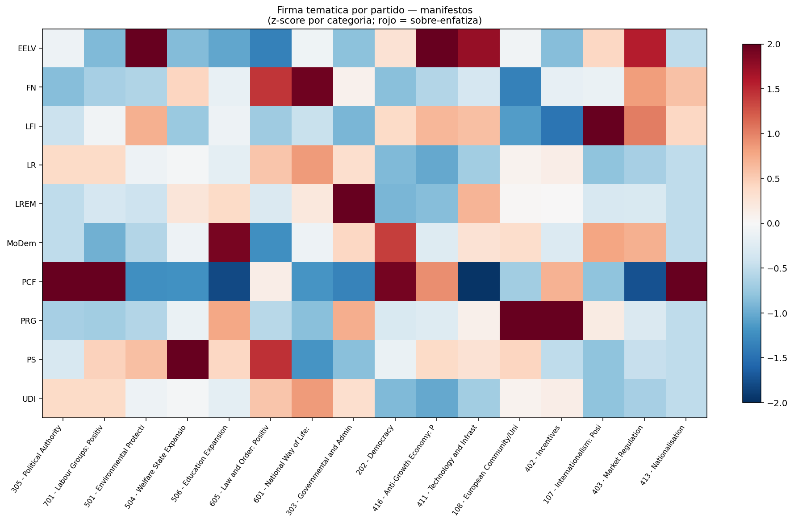
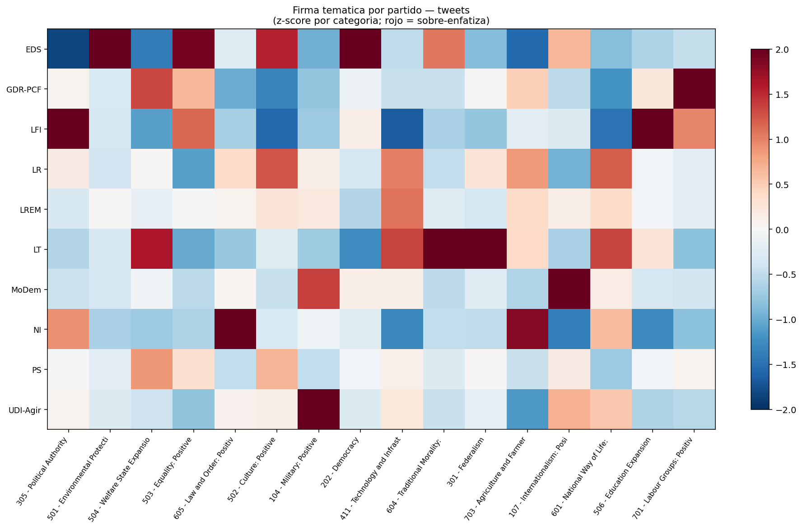
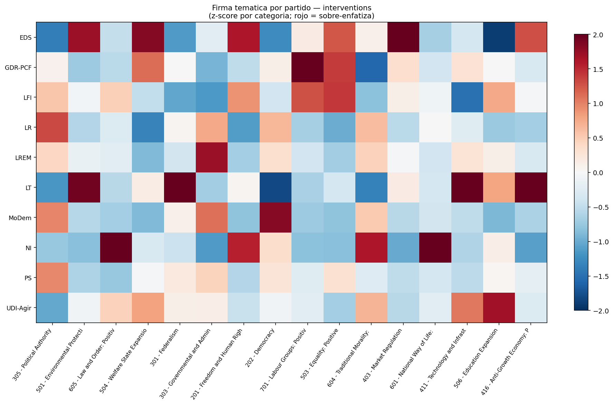
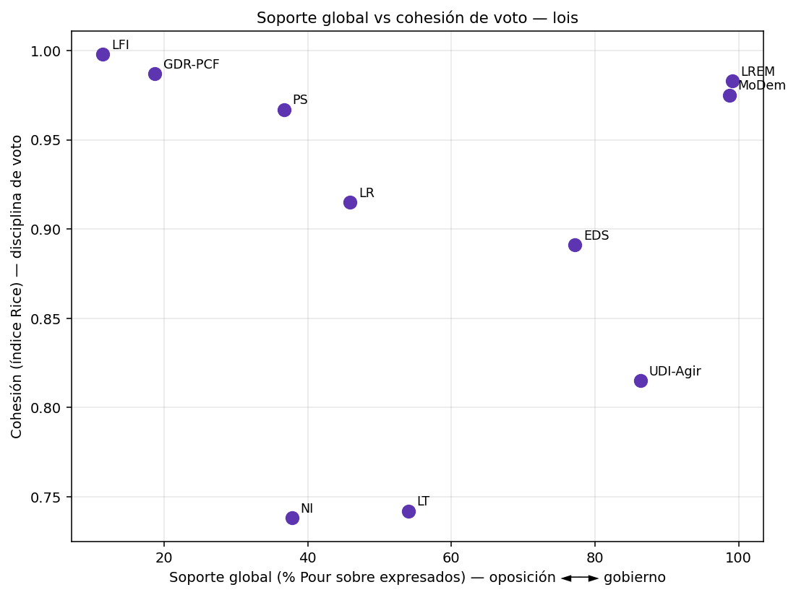
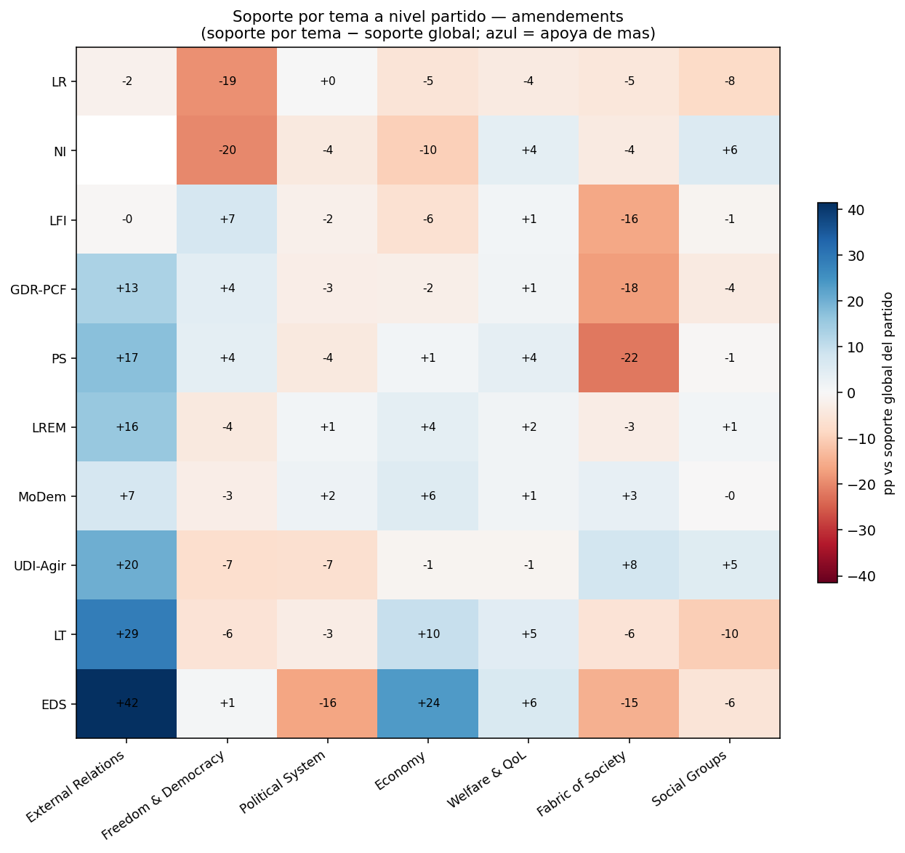
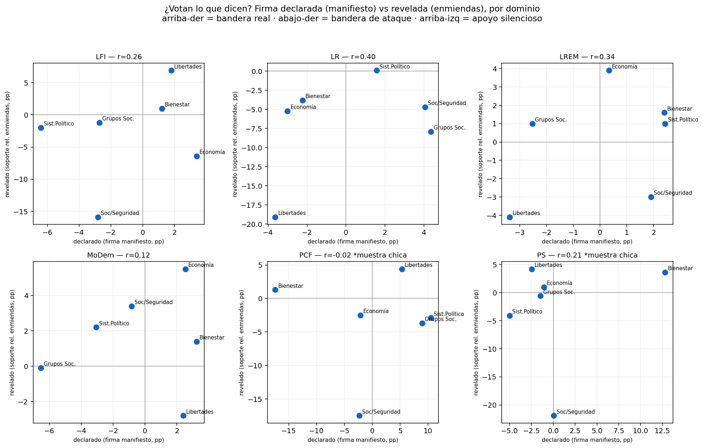

# Análisis a nivel partido — agenda declarada (énfasis) y revelada (voto) del corpus francés (XV legislatura)

Este módulo busca **insights a nivel de partido** sobre las clasificaciones MARPOR de [`manifestoberta_analysis/`](../manifestoberta_analysis/). La pregunta no es *dónde se ubica* cada partido (posición izquierda-derecha — eso es frágil con RILE, ver [`ches_analysis/`](../ches_analysis/)), sino **de qué habla**: su agenda, su énfasis temático, su "firma".

Trabajar con la distribución completa sobre los **7 dominios** y las **56 categorías** MARPOR es robusto: describe el énfasis observado sin colapsarlo a un eje, y no sufre el problema de dirección que rompe a RILE.

Hay **dos familias de corpus**, con dos formas de atribuir el texto a un partido:

1. **Texto producido por el partido** (`manifestos/`, `tweets/`, `interventions/`): el partido *escribe* el texto. La señal es el **énfasis** (de qué habla) → agenda *declarada*.
2. **Texto votado por el partido** (`lois/`, `amendements/`): una ley o enmienda no tiene autor partidario, pero el partido revela su preferencia **votando**. La señal es el **soporte por tema** (qué políticas apoya/rechaza) → agenda *revelada*. Ver la sección [Leyes y enmiendas](#leyes-y-enmiendas-agenda-revelada-por-el-voto).

El contraste entre lo que un partido *dice* y lo que *vota* es el núcleo del análisis.

## Métricas (por partido, en cada corpus)

| Métrica | Qué mide | Archivo |
|---|---|---|
| **Énfasis por dominio** | % de quasi-frases en cada uno de los 7 dominios MARPOR | `party_domain_distribution.csv` |
| **Distribución por categoría** | % en cada una de las 56 categorías | `party_category_distribution.csv` |
| **Distintividad** | cuánto sobre/sub-enfatiza cada categoría vs. el promedio del corpus (en puntos porcentuales) → *la firma* | `distinctive_categories.csv` |
| **Concentración de agenda** | *evenness* = entropía normalizada de la distribución de categorías (baja = monotemático; alta = agenda diversa) | `agenda_concentration.csv` |

Figuras por corpus: `heatmap_party_domain.png` (partido × dominio) y `heatmap_party_signature.png` (partido × categorías más discriminantes, z-score).

## Hallazgo transversal: el canal define la agenda

El mismo partido habla de cosas distintas según el canal. El dominio dominante cambia radicalmente:

| Dominio dominante | manifiestos | tweets | hemiciclo |
|---|---|---|---|
| **Welfare & QoL** (políticas sociales) | **sí** (~30%) | no | no |
| **Political System** (gobierno, autoridad, instituciones) | bajo (~6–15%) | **sí** (~30–41%) | **sí** (~25–41%) |

- Los **manifiestos** son *programa*: dominan las políticas sustantivas (welfare, economía).
- Los **tweets** y el **hemiciclo** son *meta-política*: hablan del gobierno, la autoridad, las instituciones. Twitter es el más extremo.

Pero —y esto es lo valioso— **la firma distintiva de cada partido se mantiene a través de los canales**, aunque cambie el volumen general: los ecologistas siempre sobre-enfatizan medio ambiente, el PCF/GDR a los trabajadores, los no-inscritos (RN) a ley y orden. Cada partido conserva su *issue ownership* aunque adapte cuánta meta-política hace según el canal.

## Manifiestos (`manifestos/`)

3.801 quasi-frases, 10 partidos. Dominio dominante casi universal: **Welfare & QoL**. Lo interesante son las firmas:

| Partido | Categoría más distintiva | +pp vs corpus |
|---|---|---:|
| EELV | 501 Protección Ambiental | +8.0 |
| PS | 504 Expansión del Estado de Bienestar | +7.5 |
| FN | 601 National Way of Life (nacionalismo) | +5.5 |
| MoDem | 506 Expansión Educativa | +5.4 |
| LREM | 303 Eficiencia Gubernamental | +5.1 |
| PRG | 108 Unión Europea: Positivo | +5.0 |
| LFI | 107 Internacionalismo: Positivo | +5.0 |
| PCF | 305 Autoridad Política | +17.1 |



**Insight:** las firmas reproducen con precisión la identidad conocida de cada partido — ecologistas→ambiente, PS→bienestar, FN→nación, LFI→internacionalismo, LREM→gestión técnica. Es, de paso, una validación cualitativa fuerte del clasificador: captura perfiles temáticos con sentido político.

> **Caveats de datos:** **LR y UDI son idénticos** en este corpus (comparten manifiesto / filas duplicadas), así que cuentan como uno. **PCF (39 frases)** y **PS (79)** tienen muestra chica: su firma es indicativa, no robusta (el +17pp de 305 del PCF es ruido de muestra).

## Tweets (`tweets/`)

224.056 quasi-frases, 10 familias políticas (grupos parlamentarios consolidados). El dominio **Political System estalla**: LFI 41%, NI 37%, LR 33%, vs. ~6–15% en los manifiestos.

| Partido | Categoría más distintiva | +pp |
|---|---|---:|
| LFI | 305 Autoridad Política | +10.2 |
| EDS | 501 Protección Ambiental | +9.0 |
| NI (incl. RN) | 605 Ley y Orden | +4.6 |
| GDR-PCF | 504 Expansión del Bienestar | +3.5 |
| MoDem | 107 Internacionalismo | +2.5 |
| LR | 502 Cultura | +2.2 |



**Insights:**
- **LFI usa Twitter como megáfono anti-gobierno.** Es el más monotemático (evenness 0.65) y el que más sobre-enfatiza *Autoridad Política* (+10pp): su discurso en redes gira en torno al poder/gobierno, no a políticas sustantivas. (Esto es justo lo que "rompía" a RILE, pero acá es un hallazgo, no un artefacto.)
- **Los no-inscritos (donde está el RN) sobre-enfatizan Ley y Orden** (+4.6pp) y *Fabric of Society* — firma clara de derecha radical securitaria.
- **MoDem es el más europeísta** (16.7% External Relations, +Internacionalismo), coherente con su perfil centrista pro-UE.
- En general, **en Twitter los partidos son más monotemáticos** que en sus programas y convergen al dominio Political System: la red aplana la sustancia y premia el conflicto institucional.

## Hemiciclo (`interventions/`)

338.192 quasi-frases. También domina Political System, pero más repartido, y sube *Freedom & Democracy* (~12–15%) — debate procedimental y de derechos.

| Partido | Categoría más distintiva | +pp |
|---|---|---:|
| LR | 305 Autoridad Política | +7.8 |
| NI (incl. RN) | 605 Ley y Orden | +6.1 |
| MoDem / PS / LFI | 305 Autoridad Política | +5.7 / +5.7 / +3.3 |
| LT | 501 Protección Ambiental | +5.0 |
| GDR-PCF | 701 Grupos Laborales (trabajadores) | +3.0 |
| LREM | 303 Eficiencia Gubernamental | +2.9 |



**Insights:**
- **La oposición fiscaliza al gobierno.** *Autoridad Política* (305) es la categoría más distintiva de casi todos los grupos de oposición (LR el más, +7.8pp): el hemiciclo es, por naturaleza, el espacio para interpelar al ejecutivo. Por eso 305 discrimina menos acá que en tweets (es el piso del debate parlamentario).
- **LREM, partido de gobierno, defiende la gestión:** su seña es *Eficiencia Gubernamental* (303), no la crítica.
- **GDR-PCF mantiene su ADN obrero** (701 Grupos Laborales), y **NI** vuelve a marcar *Ley y Orden*: las firmas ideológicas persisten respecto del corpus de tweets.

---

# Leyes y enmiendas: agenda revelada por el voto

Acá cambia el método. Una ley o enmienda no la "escribe" un partido, así que no tiene sentido medir su *énfasis*. Lo que medimos es **cómo vota** cada partido, cruzando tres fuentes:

- el **texto** del scrutin → su composición temática MARPOR (de manifestoberta),
- el **voto** de cada diputado (`Pour`/`Contre`/`Abstention`) en ese scrutin (`lois_votes/`),
- el **partido** de cada diputado (`datos_diputados/`).

El join es limpio: **100%** de los votos casan con un diputado y **100%** de los scrutins con texto tienen votos. Cubrimos **335 leyes** y **2.575 enmiendas**, 10 familias políticas.

### Métricas (por partido)

| Métrica | Definición | Lee |
|---|---|---|
| **Soporte global** | % de `Pour` sobre votos expresados (`Pour`+`Contre`) | gobierno (alto) vs oposición (bajo) |
| **Cohesión (Rice)** | `|Pour−Contre| / (Pour+Contre)` promedio | disciplina de voto (1 = unánime) |
| **Soporte por tema** | soporte ponderado por cuánto carga cada dominio en el texto | qué clases de política apoya |
| **Soporte relativo** | soporte por tema − soporte global | perfil temático *neto* del efecto gobierno/oposición |

## Hallazgo 1 — Leyes y enmiendas invierten la estructura de apoyo

El mismo partido vota al revés según el instrumento:

| | Gobierno (LREM/MoDem) | Oposición de izquierda (LFI/GDR/PS) |
|---|---|---|
| **Leyes** (voto final) | apoyan ~99% | rechazan (LFI 11%, GDR 19%) |
| **Enmiendas** | rechazan (LREM 16%, MoDem 22%) | apoyan (GDR 87%, LFI 84%, PS 83%) |

Es la dinámica parlamentaria clásica, ahora cuantificada: **el gobierno defiende el texto y bloquea las enmiendas; la oposición bloquea la ley pero empuja enmiendas**. El voto es **posicional/estratégico**, no temático: en leyes mide quién está en la mayoría, no qué temas gustan. Por eso el análisis temático interesante es el **relativo** (neto de esa posición).

## Hallazgo 2 — Cohesión: quién vota en bloque



- **LFI es el partido más disciplinado** (Rice 0.998 en leyes, 0.997 en enmiendas): vota como un bloque casi perfecto. Le siguen GDR-PCF y el partido de gobierno LREM.
- **Los no-inscritos (NI, 0.74) y Liberté-et-Territoires (LT, 0.74) son los menos cohesionados** — lógico: son agrupaciones heterogéneas, no partidos. La cohesión valida la consolidación de grupos: las familias reales votan unidas, las bolsas mixtas no.
- En el scatter de leyes se ve el eje **oposición (izq) → gobierno (der)** en horizontal, con la oposición de izquierda *y* el gobierno arriba (ambos muy disciplinados) y los grupos mixtos abajo.

## Hallazgo 3 — Clivajes ideológicos revelados por las enmiendas

Centrando por soporte global (soporte relativo), las enmiendas exponen clivajes que el voto de leyes esconde:



- **Clivaje cultural (Fabric of Society = identidad, seguridad, nación):** la izquierda lo **apoya sistemáticamente de menos** (PS −22, GDR −18, LFI −16 pp respecto de su base — aunque en absoluto siga aprobando en mayoría, 60–69% Pour), el centro-derecha lo apoya de más (UDI-Agir +8, MoDem +3). Es el eje cultural/securitario hecho voto.
- **Clivaje de libertades (Freedom & Democracy):** se invierte — la izquierda lo apoya de más (LFI +7, GDR +4, PS +4), la derecha lo **apoya de menos** (LR −19, NI −20). Derechos civiles vs. orden.
- **Economía:** los ecologistas (EDS +24) y LT (+10) empujan enmiendas económicas mucho más que su base; la derecha clásica (LR −5) menos.
- **Consenso en política exterior:** *External Relations* es el tema que casi todos apoyan por encima de su base — las enmiendas de defensa/exterior/UE cruzan líneas partidarias.

> **Síntesis del núcleo:** el voto revela dos capas. Una **posicional** (gobierno vs oposición), que domina el voto de leyes y es casi pura disciplina. Y una **temática/ideológica**, que aflora en las enmiendas: izquierda y derecha se separan limpiamente en el eje cultural (seguridad/identidad vs libertades), no tanto en el económico. Esto contrasta con la agenda *declarada* (manifiestos/tweets): un partido puede *hablar* mucho de un tema y *votar* distinto — y ese gap declarado-vs-revelado es el aporte central de la tesis.

---

# Declarado vs. revelado: ¿votan lo que dicen? (`declarado_vs_revelado/`)

El cierre del arco cruza las dos agendas. Como viven en unidades distintas (la declarada es *salience* no signada, la revelada es *soporte* signado), no se restan: se comparan como **firmas relativas entre partidos** (distintividad centrada), y la **tipología por celda** (partido × dominio) es el resultado central. Ver [`declarado_vs_revelado/03_declarado_vs_revelado.md`](declarado_vs_revelado/03_declarado_vs_revelado.md).



- **Énfasis respaldado** (coherencia afirmativa: enfatiza y apoya por encima de su base): LFI↔libertades (+6.9 relativo), PS↔bienestar, eco-izquierda (EDS, LT)↔bienestar/economía, bloque gubernamental centrista (LREM, MoDem)↔economía. La identidad temática se sostiene del discurso al voto en los temas *propios*.
- **Coherencia negativa en el eje cultural:** la izquierda no se apropia discursivamente de *Fabric of Society* (énfasis positivo ausente en sus 9 combinaciones partido-canal) y lo apoya *relativamente* menos (PS −22, PCF −18, LFI −16) — aunque su apoyo **absoluto** siga siendo mayoría (60–69%). El clivaje cultural del Análisis 2 es una distancia sostenida, no un voto táctico.
- **Énfasis no respaldado / oposicional** (enfatiza pero apoya por debajo de su base): LR (cultura/seguridad), NI (libertades) — uso confrontativo del tema.
- **En el agregado la coherencia es débil** (pooled 0.12–0.19 sobre los 6 partidos comparables) y, por partido, el coeficiente es demasiado ruidoso para rankear (IC95 ≈ [−1, +1] con solo 6 dominios). La estructura interpretable está en los signos por celda, no en el coeficiente.

> **Precisión clave:** "soporte relativo negativo" ≠ "vota en contra". Mide desviación respecto de la base de apoyo del propio partido, no apoyo absoluto (ver `declarado_vs_revelado/03_declarado_vs_revelado.md` §1.2).

## Reproducir

```bash
cd french_deputies/party_analysis
# (requiere pandas, numpy, matplotlib)
# agenda declarada (énfasis):
python3 -u manifestos/run.py     2>&1 | tee manifestos/results/run.log
python3 -u tweets/run.py         2>&1 | tee tweets/results/run.log
python3 -u interventions/run.py  2>&1 | tee interventions/results/run.log
# agenda revelada (voto):
python3 -u lois/run.py           2>&1 | tee lois/results/run.log
python3 -u amendements/run.py    2>&1 | tee amendements/results/run.log
# declarado vs revelado (requiere los results/ de arriba; usa scipy):
python3 -u declarado_vs_revelado/build.py 2>&1 | tee declarado_vs_revelado/results/run.log
```

## Estructura del módulo

```
party_analysis/
├── README.md
├── common/
│   ├── analysis.py        # énfasis: distribuciones, distintividad, concentración, heatmaps
│   └── votes.py           # voto: soporte por tema, cohesión (Rice), agenda apoyada/rechazada
├── manifestos/            # agenda declarada
│   ├── run.py
│   └── results/           # *_distribution.csv, distinctive_categories.csv, agenda_concentration.csv, summary.json, 2 heatmaps, log
├── tweets/
│   └── results/
├── interventions/
│   └── results/
├── lois/                  # agenda revelada por el voto
│   ├── run.py
│   └── results/           # party_domain_support[_relative].csv, party_cohesion.csv, supported_vs_opposed_agenda.csv, summary.json, 2 figuras, log
├── amendements/
│   ├── run.py
│   └── results/
└── declarado_vs_revelado/     # cruce agenda declarada × revelada
    ├── build.py
    ├── 03_declarado_vs_revelado.md
    └── results/               # coherence_*.csv, declared_revealed_aligned.csv, quadrant_typology_*, pooled_coherence.csv, 3 figuras, summary.json, log
```

## Notas metodológicas

- **Partido en tweets/hemiciclo/votos:** se deriva del grupo parlamentario (`political_group_abbrev`) consolidado a familia política (`GROUP_LABEL` en `common/analysis.py`): p.ej. `DEM`+`MODEM`→MoDem, `SOC`+`NG`→PS, `LR`+`LC`→LR, todos los `UDI*`+`AGIR-E`→UDI-Agir. `NI` (no-inscritos, donde está el RN) se conserva como categoría propia. Filtro mínimo: 1.000 frases por familia (manifiestos: 30).
- **Énfasis** (manifiestos/tweets/hemiciclo) describe *salience* (cuánto se habla de algo). La **distintividad** se mide contra el promedio *del propio corpus*, comparable entre partidos dentro de un canal, no entre canales.
- **Voto** (leyes/enmiendas): un scrutin entra al cálculo de un partido solo si ≥3 de sus diputados expresan voto (`Pour`/`Contre`); las abstenciones y no-votantes se excluyen del denominador. El **soporte por tema** pondera por la composición MARPOR del texto; el **soporte relativo** lo centra por el soporte global del partido para aislar la señal temática del efecto gobierno/oposición.
- Para postura/posición izquierda-derecha (no énfasis ni voto) ver `ches_analysis/`.
