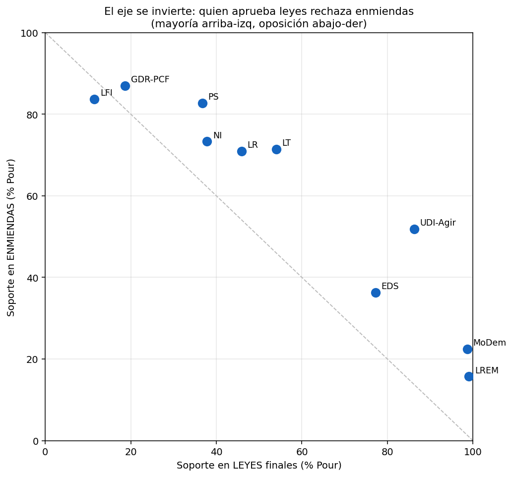
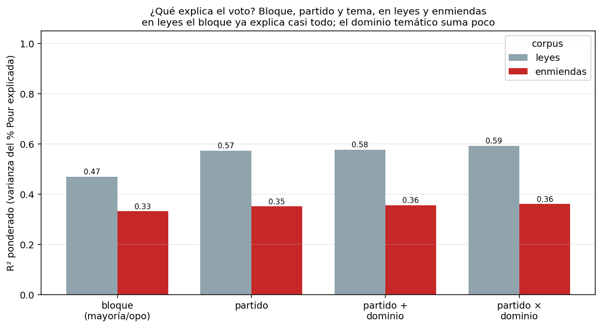
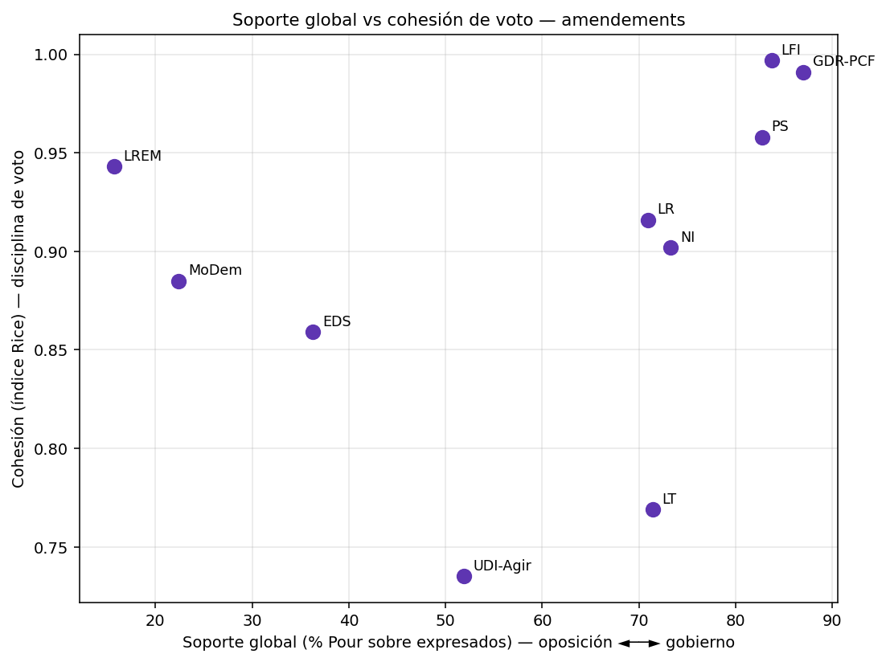

# Análisis 2 — La agenda revelada: posición primero, clivajes después

> **El voto final mide el bloque; las enmiendas debilitan esa lógica y revelan un clivaje cultural modesto pero consistente.**
>
> Documento separado del Análisis 1 (`cross_channel/01_canal_cambia_agenda.md`, *agenda declarada*). Aquí no se mira lo que el partido **dice**, sino lo que **revela votando**.

**Pregunta:** ¿el voto parlamentario revela preferencias temáticas, o solo disciplina gobierno/oposición?

Una ley o una enmienda no tienen autor partidario: el partido revela su preferencia **votando** Pour/Contre. Cruzamos el **texto** del scrutin (su composición temática MARPOR) con el **voto** de cada diputado y su **partido**, sobre dos corpus muy distintos:

- **Leyes** (votos finales sobre projets/propositions de loi): 335 scrutins con texto y votos.
- **Enmiendas** (votos sobre enmiendas a esas leyes): 2.575 scrutins.

En total votan **647 diputados** en las leyes y **643** en las enmiendas (más que los 577 escaños por el recambio a lo largo de la legislatura 2017–2022: suplentes, renuncias, reemplazos). Su reparto por partido —que pondera cuánto se puede confiar en cada fila partido×scrutin— es:

| Partido | diputados (leyes) | diputados (enmiendas) |
|---|---:|---:|
| LREM | 315 | 314 |
| LR | 126 | 125 |
| MoDem | 59 | 58 |
| PS | 38 | 38 |
| UDI-Agir | 33 | 33 |
| NI | 19 | 19 |
| GDR-PCF | 18 | 17 |
| LFI | 17 | 17 |
| LT | 13 | 13 |
| EDS | 9 | 9 |

Los grupos chicos (EDS 9, LT 13, LFI/GDR ~17) tienen pocos diputados, así que su tasa de Pour por scrutin descansa en pocas personas; el filtro de ≥3 diputados expresando voto por scrutin y la ponderación por nº de votos lo tienen en cuenta.

La tesis del capítulo: **el voto final de una ley mide sobre todo posición institucional** (mayoría vs oposición); **el voto sobre enmiendas debilita esa lógica de bloque** y deja aflorar clivajes temáticos modestos —y, sorprendentemente, más **culturales** que económicos. No "las enmiendas son más temáticas en varianza explicada" (no lo son), sino "la posición pesa menos en enmiendas y en ese hueco aparece un clivaje cultural legible".

---

## 1. El eje se invierte: quien aprueba leyes rechaza enmiendas

| Partido | Soporte en **leyes** (% Pour) | Soporte en **enmiendas** (% Pour) |
|---|---:|---:|
| LREM | **99.1** | **15.7** |
| MoDem | 98.7 | 22.4 |
| UDI-Agir | 86.3 | 51.9 |
| EDS | 77.2 | 36.3 |
| LT | 54.0 | 71.4 |
| LR | 45.9 | 70.9 |
| NI | 37.8 | 73.3 |
| PS | 36.7 | 82.7 |
| GDR-PCF | 18.7 | 87.0 |
| LFI | **11.5** | **83.7** |



Los partidos se ordenan sobre la **antidiagonal**: el eje se invierte casi perfectamente.

- **En leyes finales manda la posición:** la mayoría presidencial (**LREM 99%, MoDem 99%**) vota Pour casi siempre; la oposición de izquierda (**LFI 11%, GDR-PCF 19%**) rechaza. Saber a qué bloque pertenece un partido **basta** para predecir su voto.
- **En enmiendas se da vuelta:** ahora la izquierda apoya (**GDR-PCF 87%, LFI 84%, PS 83%**) y el gobierno rechaza (**LREM 16%, MoDem 22%**). La razón institucional: las enmiendas son mayoritariamente **intentos de la oposición de modificar** el texto del gobierno, que defiende su versión votándolas en contra.

**Matiz importante:** las enmiendas, en bruto, **también son posicionales** —solo que con el signo invertido—. El argumento fuerte no es "las enmiendas no son posicionales", sino que **la lógica de bloque explica menos**, y eso abre espacio temático. Eso es lo que mide la sección 2.

---

## 2. ¿Posición o tema? Descomposición del poder explicativo

Estimamos, **por separado en cada corpus**, cuatro modelos anidados sobre la unidad *partido × scrutin* (outcome = % Pour entre votos expresados, ponderado por nº de votos):

- **Bloque:** solo mayoría (LREM+MoDem) vs oposición. ¿Basta el binario gobierno/oposición?
- **Partido:** los 10 partidos. ¿Importa la identidad fina por encima del bloque?
- **Partido + dominio:** añade el tema MARPOR dominante del texto (aditivo).
- **Partido × dominio:** permite que el tema module el apoyo de cada partido (interacción).

Comparamos **capacidad explicativa** (R² ponderado), no p-valores: con cientos de miles de votos casi todo es "significativo"; lo informativo es cuánta varianza explica cada capa.

| Corpus | R² bloque | R² partido | R² +dominio | R² partido×dominio |
|---|---:|---:|---:|---:|
| **Leyes** | **0.47** | 0.57 | 0.58 | 0.59 |
| **Enmiendas** | **0.33** | 0.35 | 0.36 | 0.36 |



Lectura honesta (los datos matizan la hipótesis simple):

1. **Las leyes son casi pura posición, y casi pura *bloque*.** Un único binario mayoría/oposición ya explica el **47%** de la varianza; el partido fino añade solo **+10 pp** (0.57) y el tema **nada** (+2 pp). En la ley final el bloque es, en gran medida, destino. El +10 pp del partido refleja que la **oposición no es monolítica** (LFI rechaza más que LR): hay un gradiente que el binario no captura, pero el grueso lo da el bloque.
2. **En enmiendas todo explica menos, y el partido fino casi no agrega sobre el bloque** (0.33 → 0.35, +2 pp). La lógica posicional **se afloja**: queda bastante variación de voto que no se reduce ni al bloque ni al partido.
3. **El dominio temático *dominante* tampoco llena ese hueco** (+1 pp). La varianza extra de las enmiendas es en buena parte **idiosincrásica de cada enmienda** (su contenido puntual), no un efecto limpio de los 7 dominios MARPOR tomados como etiqueta única.

> Es decir: la versión cruda "las enmiendas son más temáticas *en varianza explicada*" **no se sostiene**. Lo robusto es la **asimetría de la capa posicional**: en leyes el bloque ya explica el grueso (0.47 de 0.57); en enmiendas la posición pesa mucho menos (0.33), dejando espacio para una diferenciación que la etiqueta de dominio no captura del todo. El clivaje temático existe, pero hay que medirlo de otra forma (sección 3).

---

## 3. El clivaje temático sí aparece — y es cultural

Que el dominio explique poca *varianza total* no significa que no haya estructura temática: significa que es un **corrimiento sistemático de la media**, pequeño frente al ruido enorme de cada enmienda. Para verlo usamos el **soporte relativo**:

$$\text{SoporteRelativo}_{p,d} = \text{Soporte}_{p,d} - \text{SoporteGlobal}_{p}$$

Resta a cada partido su nivel general de apoyo (su posición gobierno/oposición), dejando solo **qué apoya de más o de menos según el tema**.

> **Qué significa (y qué no) un soporte relativo negativo.** Mide desviación respecto de la **base de apoyo del propio partido**, no apoyo absoluto: un valor negativo **no implica** votar mayoritariamente `Contre`. PS, LFI y GDR-PCF, pese a su −16/−22 relativo en *Fabric of Society*, **siguen aprobando en mayoría** esas enmiendas en términos absolutos (PS 60.8%, LFI 67.8%, GDR-PCF 69.5% Pour) — solo que ~16–22 pp por debajo de su altísima base (~83–87%). El signo relativo negativo coincide con minoría absoluta únicamente en grupos de bajo apoyo global (el gobierno, que bloquea enmiendas; EDS). Por eso abajo se usa "**apoya de menos / de más**" y no "rechaza/apoya" a secas.


En **enmiendas** el patrón es nítido y se ordena por un eje **cultural**, no económico:

- **Fabric of Society** (orden público, inmigración, modo de vida nacional) **parte izquierda/derecha:** la izquierda lo apoya **de menos** (PS **−21.9**, GDR-PCF −17.5, LFI −15.9, EDS −14.9); la derecha/centro lo apoya de más (UDI-Agir **+7.7**, MoDem +3.4).
- **Freedom & Democracy** (libertades, derechos, democracia) es el **espejo**: la derecha lo apoya **de menos** (LR **−19.1**, NI −19.8 — aunque su apoyo absoluto sigue rozando la mayoría: LR 51.8%, NI 53.5%) y la izquierda lo apoya **de más** (LFI **+7.0**, GDR-PCF +4.4, PS +4.2).
- **Economy** polariza **menos** de lo esperado: los signos están mezclados (EDS +23.6 y LT +9.6 arriba; LFI −6.4, LR −5.2 abajo), sin un eje izquierda-derecha limpio.

### ¿Es real o ruido? Bootstrap por scrutin

Las filas no son independientes: cada scrutin genera varias filas partido×scrutin. Para no leer ruido, remuestreamos **scrutins** (clústeres) con reemplazo (1.000 réplicas), recalculamos el soporte relativo y miramos el IC95 y la **estabilidad de signo** (% de réplicas que conservan el signo) de las dos puntas del clivaje:

| Partido | dominio | soporte rel. (pp) | IC95 | estab. signo |
|---|---|---:|---|---:|
| PS | Fabric of Society | −21.9 | [−29.7, −14.2] | 1.00 |
| LFI | Fabric of Society | −15.9 | [−23.9, −8.4] | 1.00 |
| GDR-PCF | Fabric of Society | −17.5 | [−27.4, −7.1] | 1.00 |
| EDS | Fabric of Society | −14.9 | [−25.1, −4.6] | 1.00 |
| LR | Freedom & Democracy | −19.1 | [−25.0, −13.9] | 1.00 |
| NI | Freedom & Democracy | −19.9 | [−27.8, −12.5] | 1.00 |
| LFI | Freedom & Democracy | +7.0 | [+2.7, +11.2] | 1.00 |

Las puntas del clivaje son **estadísticamente sólidas**: el **menor apoyo relativo** de la **izquierda a Fabric of Society** y el de la **derecha (LR, NI) a Freedom & Democracy** mantienen el signo en ~100% de las réplicas y sus IC excluyen el cero. El lado más débil es el apoyo *positivo* de la derecha a Fabric of Society (UDI-Agir +7.7, IC [−0.2, 15.6] roza el cero): el clivaje se sostiene sobre todo porque **cada bloque apoya de menos el tema del otro**, no tanto por un apoyo entusiasta.

**Hallazgo de fondo (y contraintuitivo):** en el voto de enmiendas, el conflicto que aflora con más claridad **no es el económico sino el cultural/securitario/libertades**, y **no depende de unos pocos votos** (sobrevive al bootstrap por scrutin). Desafía la expectativa simple de que "la política francesa se ordena ante todo por economía".

> Cómo conciliar con la sección 2: el soporte relativo es una **diferencia de medias** (sistemática y robusta), mientras que el R² castiga esa señal porque la varianza dentro de cada dominio es enorme. El clivaje cultural es **legible y consistente**, pero **modesto en magnitud**: mueve el apoyo promedio en enmiendas culturales, sin ser el motor de ningún voto individual.

---

## 4. Chequeo de leverage (qué tan confiable es cada dominio)

Antes de sobre-leer la heatmap: ¿cuántos scrutins sostienen cada dominio?

| Dominio | scrutins en leyes | scrutins en enmiendas |
|---|---:|---:|
| Welfare & QoL | 102 | 1.107 |
| Economy | 50 | 423 |
| Freedom & Democracy | 20 | 266 |
| Political System | 83 | 264 |
| Fabric of Society | 55 | 253 |
| Social Groups | 20 | 246 |
| **External Relations** | **5** | **16** |

- **External Relations es ruido de pocos casos:** descansa en **5 leyes y 16 enmiendas**. Sus valores enormes de soporte relativo (EDS +41.5, LT +28.6, NI +21.5…) **no son interpretables** y se descartan de la lectura. Era el sospechoso obvio y el chequeo lo confirma.
- **El hallazgo cultural sobrevive:** Fabric of Society (253 enmiendas) y Freedom & Democracy (266) tienen base muestral sólida. El clivaje no es artefacto.

**Pero ¿y si esas 253 enmiendas vienen de una sola gran ley?** Un dominio puede tener muchas enmiendas pero concentradas en un único debate (p. ej. una ley de seguridad), y entonces el patrón reflejaría esa batalla puntual, no el dominio. Por eso miramos en cuántas **leyes distintas** se reparte cada dominio (enmiendas):

| Dominio | nº enmiendas | nº leyes distintas | máx. en una sola ley |
|---|---:|---:|---:|
| Welfare & QoL | 1.107 | 118 | 14.5% |
| Economy | 423 | 73 | 12.5% |
| Freedom & Democracy | 266 | 54 | 16.9% (ley de inmigración/asilo) |
| Political System | 264 | 69 | 14.0% |
| Fabric of Society | 253 | 53 | 14.6% (ley de programación/seguridad) |
| Social Groups | 246 | 51 | 17.1% |
| External Relations | 16 | 10 | 31.2% |

El clivaje cultural **está bien distribuido**: Fabric of Society se reparte en **53 leyes** distintas (ninguna aporta más del 15%) y Freedom & Democracy en **54** (máx. 17%, una ley de inmigración). No es un solo debate legislativo el que lo genera. (External Relations vuelve a quedar señalado: 16 enmiendas y un único texto con el 31%.)

---

## 5. Cohesión (apoyo, no eje central)

La cohesión por **índice Rice** —$|Pour-Contre|/(Pour+Contre)$, ~1 = unanimidad— no es el corazón del capítulo, pero **valida el agrupamiento partidario** y aporta un matiz sustantivo.



- **LFI es el partido más disciplinado** (Rice 0.998 en leyes, 0.997 en enmiendas): radical en el discurso, sí, pero **férreamente unido** en el voto. Su radicalidad no es indisciplina.
- **NI y LT son heterogéneos** (NI 0.74 en leyes; UDI-Agir/LT ~0.74–0.77): no deben leerse como partidos homogéneos, sino como agregados de no-inscritos y grupos mixtos. Su baja cohesión **justifica empíricamente** tratarlos aparte en el resto del análisis.
- La alta cohesión del resto (PS, GDR-PCF, LREM, MoDem, LR todos >0.88) respalda que **consolidar grupos parlamentarios en familias** tiene sentido: dentro de cada familia el voto es coherente.

---

## Síntesis del Análisis 2

1. **El voto tiene dos capas, y la primera es la posición.** En leyes, un binario **mayoría/oposición** ya explica el 47% de la varianza (el partido fino suma +10 pp por el gradiente interno de la oposición; el tema, nada). En enmiendas todo explica menos y el partido fino casi no agrega sobre el bloque (0.33 → 0.35): la posición pesa, pero menos, y el eje se **invierte**.
2. **El tema, como dominio dominante, no explica varianza extra** (Δ≈1 pp en ambos corpus). La hipótesis "enmiendas = espacio temático" hay que enunciarla con cuidado: lo que cambia es **cuánto pesa la posición**, no cuánto pesa el dominio en varianza.
3. **Pero el clivaje temático es legible en el soporte relativo, es cultural y es robusto.** La izquierda apoya relativamente **de menos** Fabric of Society y la derecha (LR, NI) hace lo propio con Freedom & Democracy (sin que ello implique voto mayoritario en contra, ver §3); ambos signos se mantienen en ~100% de las réplicas del bootstrap por scrutin y el patrón se reparte en >50 leyes distintas. La economía polariza menos.
4. **La cohesión valida el agrupamiento:** LFI disciplinadísimo; NI/LT heterogéneos; el resto coherente.

> **Frase fuerte:** *En las leyes finales basta saber si un partido está en la mayoría o en la oposición para predecir su voto. En las enmiendas esa lógica se debilita y deja ver un clivaje que, en el caso francés de esta legislatura, se ordena más por la dimensión cultural (orden, libertades, modo de vida) que por la económica —un clivaje modesto en magnitud pero estadísticamente sólido.*

## Caveats

- **Definición de bloque.** Gobierno = LREM + MoDem (mayoría presidencial 2017–2022); el resto, oposición. Es un binario deliberadamente simple; UDI-Agir (aliado intermitente) queda del lado opositor, lo que probablemente *subestima* algo el R² del bloque.
- **R² in-sample.** El modelo partido×dominio es saturado (medias de celda), así que su R² es una cota superior; la comparación válida es **los mismos modelos entre los dos corpus**, no el nivel absoluto.
- **Dominio dominante.** Reducir cada texto a su dominio MARPOR mayoritario pierde matiz. En enmiendas esto importa poco (tienen ~1–2 quasi-frases, así que "dominio dominante" ≈ composición completa); en leyes (~9 quasi-frases) una robustez con *proporciones* de dominio quedaría pendiente, aunque la heatmap ya usa la composición ponderada.
- **External Relations** se excluye de la interpretación por muestra mínima (5/16 scrutins; y 31% en un solo texto).
- **NI/LT** no son partidos homogéneos; sus métricas se leen como agregados.
- **Quién propone la enmienda (`demandeur`) no se controló.** El voto sobre una enmienda depende también de su autor (la izquierda puede apoyar de menos las enmiendas de Fabric of Society en parte porque las propone la derecha). El dato existe pero es texto libre (nombres de diputados, muchos vacíos), así que controlarlo bien es costoso; queda como **mejora pendiente de alto valor**. Igualmente, el clivaje sobrevive al bootstrap y se reparte en >50 leyes, lo que lo hace improbable de ser solo un artefacto de autoría.
- **Abstenciones.** La métrica principal es Pour/(Pour+Contre); una robustez incluyendo abstenciones queda pendiente (no debería mover el patrón).
- El soporte mide *qué se vota*, no *por qué*; la validación de que el clasificador de temas mide bien está en `ches_analysis/`.

## Reproducir

```bash
cd french_deputies/party_analysis
python3 -u lois/run.py            # soporte, cohesión, heatmap relativo (leyes)
python3 -u amendements/run.py     # idem (enmiendas)
python3 -u agenda_revelada/build.py 2>&1 | tee agenda_revelada/results/run.log
```

Salidas nuevas en `agenda_revelada/results/`:
- `variance_decomposition.csv` — R² de los 4 modelos (bloque, partido, +dominio, ×dominio) por corpus.
- `support_lois_vs_amend.csv` — soporte global por partido en ambos corpus.
- `enmiendas_relative_support_ci.csv` — soporte relativo con IC95 y estabilidad de signo (bootstrap por scrutin).
- `domain_leverage.csv` — nº de scrutins por dominio.
- `domain_leverage_by_law.csv` — nº de leyes distintas y concentración máxima por dominio.
- `r2_decomposition.png`, `scatter_lois_vs_amend.png`, `summary.json`.

Insumos reutilizados: soporte relativo y cohesión ya calculados en `lois/results/` y `amendements/results/`.
