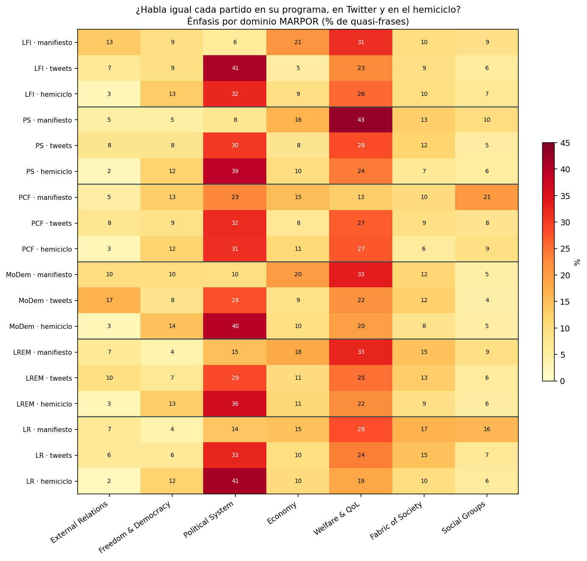
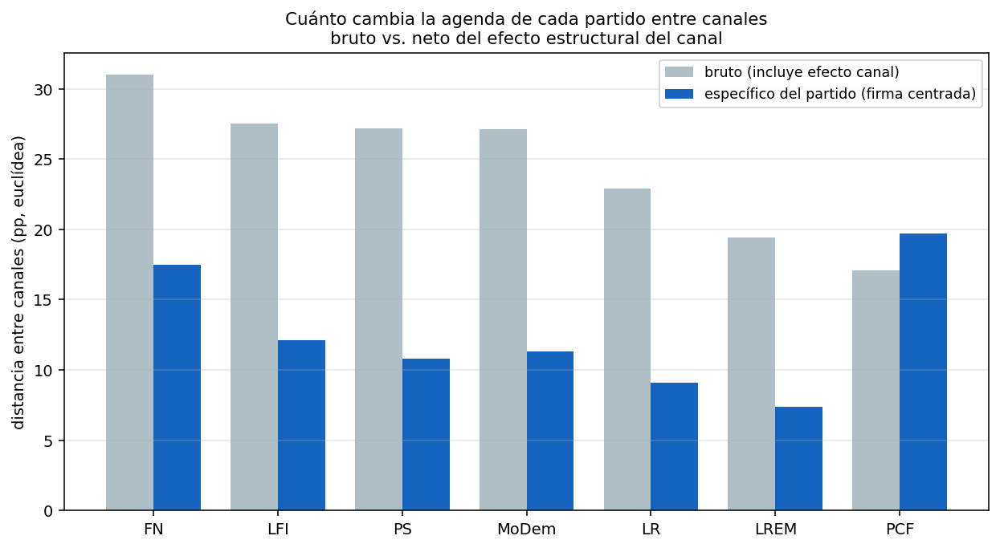

# Análisis 1 — El canal cambia la agenda

> **¿Un partido habla igual en su manifiesto, en Twitter y en el hemiciclo?**

Este es el primero de los tres ejes de la tesis. La premisa: un partido no tiene *una* agenda, sino que la **mezcla temática de lo que dice depende del canal donde se lo observe**. Aquí lo medimos partido por partido, en detalle.

## Qué se compara y cómo

Los tres canales de **agenda declarada** (texto que el partido *produce*), clasificados por manifestoberta sobre las 56 categorías / 7 dominios MARPOR:

| Canal | Qué es | Volumen |
|---|---|---|
| **manifiesto** | programa electoral 2017 | ~3.800 cuasi-frases |
| **tweets** | comunicación de los diputados en Twitter | ~224.000 |
| **hemiciclo** | intervenciones en el Parlamento | ~338.000 |

Se comparan los **7 partidos/familias presentes en los tres canales**: **FN**, LFI, LR, LREM, MoDem, PCF y PS (PCF = grupo GDR-PCF en tweets/hemiciclo). **FN** se incorpora como **familia analítica construida a partir de 11 diputados identificados por `deputy_id`** (electos en 2017 bajo bandera FN/RN, sus suplentes y Emmanuelle Ménard): en los datos parlamentarios figuran como `NI` (Non inscrit) porque no alcanzaron el umbral para formar grupo, pero aquí se aíslan como familia propia. **`NI` ya no debe interpretarse como proxy de FN/RN**: tras la separación, `NI` es una familia residual heterogénea (otros no inscritos) y no entra en esta comparación. EELV y otros siguen fuera porque solo aparecen en manifiestos o no son aislables como grupo en los tres canales.

> **Quién produce el texto (precisión importante).** Los tres canales no son el mismo tipo de actor: el **manifiesto** lo produce el partido como organización (texto oficial), mientras que **tweets** y **hemiciclo** los producen sus **diputados** individuales. Es decir, la agenda declarada mezcla texto oficial del partido con texto de sus representantes parlamentarios. No es un problema —ambos son "lo que el partido comunica"— pero conviene tenerlo explícito.

Para cada partido medimos cuatro cosas:
- **(a) Distribución por dominio** en cada canal, y **categorías más distintivas** (su firma centrada por el promedio del canal).
- **(b) Shift bruto:** distancia euclídea media (en pp) de su perfil de dominios entre los tres canales. Mide el cambio *total*, pero **confunde la estrategia del partido con el efecto estructural del canal** (todos los partidos son arrastrados hacia *Political System* en tweets/hemiciclo).
- **(c) Shift específico del partido:** lo mismo pero sobre la **firma centrada** (desviación respecto del promedio del canal). Descuenta ese efecto estructural → aísla cuánto cambia la *identidad relativa* del partido.
- **(d) Persistencia de firma:** correlación de los vectores-firma (categorías centradas) entre pares de canales. Alta = el partido sobre-enfatiza temas parecidos donde sea.

> **Nota de método.** (i) *Una sola métrica:* usamos **distancia euclídea en puntos porcentuales** en todo el análisis (no Jensen-Shannon), porque es directamente interpretable —"cambió 14 pp"— en vez de un índice abstracto entre 0 y 1. (ii) *Baseline:* el "promedio del canal" para centrar la firma se calcula **con los 7 partidos comparables** (FN, LFI, LR, LREM, MoDem, PCF, PS), no con todos los partidos del corpus, para que los tres canales tengan una referencia homogénea. **La inclusión de FN recalibra ese baseline**: como FN es extremo en algunas categorías (601 *National Way of Life*, 605 *Law and Order*, *Fabric of Society*), su entrada eleva el promedio del canal en esos temas y, por construcción, **mueve las firmas y persistencias relativas de los demás partidos** —de forma notable **LR**, que comparte con FN el énfasis nacional-identitario (601). No es un error: es el efecto esperado de recalibrar el análisis con una familia más. (iii) *Bootstrap:* los índices de shift llevan **IC95 por bootstrap** (2.000 remuestreos multinomiales de las cuasi-frases), clave porque los manifiestos de PCF (39 frases) y PS (79) son pequeños.

## El patrón general



La figura lo muestra con claridad, y es el hallazgo de fondo:

- **El manifiesto es programático:** domina **Welfare & QoL** (políticas sociales) y **Economy**. Es donde el partido despliega su oferta sustantiva.
- **Twitter y el hemiciclo son meta-política:** domina **Political System** (gobierno, autoridad, instituciones, corrupción). En Twitter de forma extrema; en el hemiciclo, casi igual.

En síntesis: **no existe "la agenda" de un partido en abstracto; la agenda depende mucho del canal.** Un mismo partido, observado en su programa o en su Twitter, parece hablar de mundos distintos.

### Cuánto cambia cada partido: bruto vs. específico

La clave: separar el cambio que es **estructural del canal** (común a todos) del que es **estrategia propia del partido**.

| Partido | shift bruto (pp) | IC95 bruto | shift específico (pp) | IC95 específico | reducción por centrado |
|---|---:|---|---:|---|---:|
| PCF* | 17.1 | [11.8, 27.5] | 19.7* | [14.3, 27.9] | −2.6 |
| **FN** | **31.0** | [28.7, 33.8] | **17.5** | [15.9, 20.7] | 13.5 |
| **LFI** | 27.5 | [26.2, 28.9] | 12.1 | [10.8, 14.2] | 15.3 |
| MoDem | 27.1 | [25.1, 29.4] | 11.3 | [9.9, 14.1] | 15.8 |
| PS | 27.2 | [23.1, 32.9] | 10.8 | [8.1, 17.9] | 16.4 |
| LR | 22.9 | [20.2, 26.0] | 9.1 | [7.5, 12.6] | 13.8 |
| **LREM** | 19.4 | [16.9, 22.2] | **7.4** | [6.2, 10.6] | 12.0 |



> La columna **"reducción por centrado"** es `bruto − específico`: cuánto baja el shift al quitar el promedio del canal. Es una **aproximación descriptiva del efecto canal**, no una descomposición aditiva exacta (son distancias, no componentes que se sumen limpiamente) — de hecho en PCF da negativa, justamente porque su manifiesto ruidoso aleja su firma centrada más que su perfil bruto. Léase como indicación, no como contabilidad.

Lo que dice:

- **El grueso del cambio es estructural del canal, no estrategia.** El centrado reduce el shift en **12–16 pp** para todos los partidos estimables: el desplazamiento hacia *Political System* en tweets/hemiciclo le pasa a todos. El shift bruto **sobreestima** cuánto "cambia de agenda" cada uno.
- **El mayor reorganizador estimable es FN.** Descontado el canal, **FN está claramente arriba** (17.5 pp, IC `[15.9, 20.7]`, sin solapamiento con el resto): es el partido que más reconfigura su firma relativa según el canal (ver bloque dedicado más abajo). **LFI le sigue** (12.1 pp) —sigue siendo un caso de reorganización importante, pero ya no el extremo del panel.
- **LREM es el más estable.** Con 7.4 pp (el más bajo) y la persistencia más alta, el partido presidencial mantiene su identidad temática entre canales. El contraste FN/LFI-arriba vs LREM-abajo sobrevive a los intervalos.
- **El medio es eso, medio.** MoDem, PS y LR (≈9–11 pp) son casos intermedios cuyos IC se solapan; **no conviene leer su orden exacto** como jerarquía. Lo que sí se ve: MoDem tenía un shift bruto alto (27.1) que era **casi todo efecto canal** (15.8), así que su cambio propio es moderado.
- **PCF* no se interpreta.** Su IC es enorme (`[14.3, 27.9]`) por las 39 frases del manifiesto: su shift **no es estimable con confianza**, así que queda fuera del ranking. El bootstrap deja eso a la vista.

### Persistencia de la firma (medida, no solo interpretada)

¿La firma de cada partido se conserva entre canales? Correlación de los vectores-firma (categorías centradas) entre canales — alta = sobre-enfatiza temas parecidos donde sea:

| Partido | corr. media entre canales | overlap (≥2 canales) | lectura |
|---|---:|---:|---|
| **LREM** | **0.412** | 5 | firma persistente (gestión/tecnología/Europa en todos lados) |
| LFI | 0.172 | 4 | manifiesto descorrelaciona; tweets↔hemiciclo sí alinean (0.37) |
| PCF | 0.156 | 4 | manifiesto descorrelaciona; tweets↔hemiciclo alinean fuerte (0.79) |
| FN | 0.148 | 3 | correlación modesta por Twitter-outlier, pero núcleo 601/605 en 3 canales |
| PS | 0.108 | 3 | bienestar en programa, fiscalización en hemiciclo |
| MoDem | 0.108 | 3 | Europa/democracia reaparecen, pero el hemiciclo desalinea |
| LR | 0.107 | 5 | cae tras recalibrar con FN (comparte 601 con FN) |

> **Cautela.** Tras la recalibración con FN, la correlación media se comprime y se reordena: la lectura robusta es que **LREM es claramente la más alta (0.412)** y que el resto queda en una banda baja (0.11–0.17) **donde el orden fino no es interpretable**. En particular, **LR cae de la zona alta a la más baja**: en buena parte porque FN eleva el baseline de los temas nacional-identitarios (601 *National Way of Life*) que LR compartía, diluyendo su distintividad en esos temas. El overlap (Opción B) matiza la correlación: LR y LREM repiten 5 categorías-firma entre canales pese a sus correlaciones dispares.

**Lo importante:** *todos los partidos son arrastrados por el canal hacia la meta-política, pero algunos conservan mucho mejor su firma relativa que otros.* LREM mantiene la identidad temática más estable; FN y LFI **reorganizan** su superficie según el canal, aunque —como muestra el overlap— pueden conservar un núcleo de temas propietarios. Ese es el eje *identidad vs. estrategia* que el Análisis 3 lleva al voto.

---

# Análisis detallado por partido

Para cada partido: su perfil de dominios en los tres canales y las categorías que lo definen en cada uno. Orden ideológico, de izquierda a derecha.

## LFI — La France Insoumise (el caso extremo)

Shift específico **12.1 pp** (el segundo más alto, tras FN) y persistencia de firma **0.172**: sigue siendo uno de los partidos que más cambia su identidad relativa según dónde habla, aunque tras recalibrar con FN ya no es el caso extremo.

| Dominio (%) | manifiesto | tweets | hemiciclo |
|---|---:|---:|---:|
| Welfare & QoL | 31 | 23 | 26 |
| Economy | 21 | 5 | 9 |
| External Relations | 13 | 7 | 3 |
| **Political System** | **6** | **41** | **32** |
| Freedom & Democracy | 9 | 9 | 13 |

**Categorías marca por canal:**
- **manifiesto:** 107 Internacionalismo (+4.9), 501 Medio Ambiente (+3.3), 403 Regulación de Mercado (+2.2), 416 Anti-crecimiento (+1.9).
- **tweets:** 305 Autoridad Política (**+7.8**), 503 Igualdad (+2.5), 506 Educación (+2.2), 201 Libertades y DDHH (+1.0).
- **hemiciclo:** 503 Igualdad (+1.9), 201 Libertades y DDHH (+1.6), 701 Trabajadores (+1.5), 501 Medio Ambiente (+1.2).

**Lectura:** en su **programa**, LFI es una izquierda **internacionalista y ecosocialista** (Europa/exterior 13%, regulación, decrecimiento). En **Twitter** ese contenido casi desaparece: Political System salta de 6% a **41%** y su marca pasa a ser *Autoridad Política* — puro **megáfono anti-gobierno**. El **hemiciclo** recupera sustancia social: su marca vuelve a ser *Igualdad*, *Libertades/DDHH* y *Trabajadores*, mientras la confrontación con el poder cede protagonismo. LFI ilustra el hallazgo con claridad: **su identidad programática y su identidad comunicativa en Twitter son casi opuestas.**

## PCF — Partido Comunista / grupo GDR (no estimable con confianza)

**Caveat fuerte:** su manifiesto tiene solo **39 cuasi-frases**. El bootstrap le da un IC enorme en el shift específico (`[14.3, 27.9]`), así que **no se puede afirmar que sea estable ni inestable**. Lo que sí es robusto: entre **tweets y hemiciclo** (los dos canales con datos suficientes) su firma correlaciona alto (0.79) — ahí su ADN obrero sí es consistente; el manifiesto es el que no es fiable.

| Dominio (%) | manifiesto | tweets | hemiciclo |
|---|---:|---:|---:|
| Welfare & QoL | 13 | 27 | 27 |
| Political System | 23 | 32 | 31 |
| Social Groups | 21 | 8 | 9 |

**Categorías marca por canal:**
- **manifiesto:** 305 Autoridad (+16.8), 701 Trabajadores (+10.4), 202 Democracia (+4.5), 413 Nacionalizaciones (+3.9) — *muestra mínima, leer con cautela*.
- **tweets:** 504 Estado de Bienestar (+3.8), 701 Trabajadores (+1.8), 503 Igualdad (+1.5), 413 Nacionalizaciones (+0.6).
- **hemiciclo:** 504 Estado de Bienestar (+3.8), 701 Trabajadores (+2.8), 503 Igualdad (+1.9), 403 Regulación de Mercado (+0.8).

**Lectura:** dejando de lado el manifiesto (ruidoso, 39 frases), el PCF muestra un **ADN obrero consistente entre tweets y hemiciclo**: *Trabajadores* (701) e *Igualdad/Bienestar* reaparecen en ambos (correlación de firma 0.79). No afirmamos que sea "el más estable" del conjunto —su shift no es estimable por la muestra del manifiesto—, pero en los canales con datos suficientes su identidad temática se sostiene.

## PS — Partido Socialista

Shift específico 10.8 pp (IC ancho `[8.1, 17.9]` por las 79 frases del manifiesto); persistencia 0.108.

| Dominio (%) | manifiesto | tweets | hemiciclo |
|---|---:|---:|---:|
| **Welfare & QoL** | **43** | 28 | 24 |
| Economy | 16 | 8 | 10 |
| Political System | 8 | 30 | 39 |

**Categorías marca por canal:**
- **manifiesto:** 504 Estado de Bienestar (**+7.1**), 605 Ley y Orden (+3.6), 501 Medio Ambiente (+2.9), 502 Cultura (+1.9).
- **tweets:** 504 Estado de Bienestar (+2.5), 502 Cultura (+1.6), 503 Igualdad (+0.9), 606 Civismo (+0.7).
- **hemiciclo:** 305 Autoridad (+2.9), 504 Estado de Bienestar (+1.1), 301 Federalismo (+0.8), 303 Eficiencia Gubernamental (+0.5).

**Lectura:** el PS es **socialdemocracia clásica**: el bienestar es **43%** de su programa, el dominante más alto de todos los partidos en cualquier canal. Pero en el hemiciclo el bienestar cede ante *Political System* (39%) y su marca pasa a ser *Autoridad* (+2.9): el canal institucional lo arrastra al rol de oposición fiscalizadora. El bienestar es su identidad declarada; la fiscalización, su rol parlamentario.

## MoDem — Mouvement Démocrate (el europeísta)

Shift específico 11.3 pp (de un bruto de 27.1: **casi todo era efecto canal**, 15.8 pp); persistencia 0.108.

| Dominio (%) | manifiesto | tweets | hemiciclo |
|---|---:|---:|---:|
| Welfare & QoL | 33 | 22 | 20 |
| Economy | 20 | 9 | 10 |
| **External Relations** | 10 | **17** | 3 |
| Political System | 10 | 28 | 40 |
| Freedom & Democracy | 10 | 8 | 14 |

**Categorías marca por canal:**
- **manifiesto:** 506 Educación (+5.2), 202 Democracia (+3.2), 606 Civismo (+2.0), 107 Internacionalismo (+1.6).
- **tweets:** 107 Internacionalismo (+2.6), 104 Militar+ (+2.2), 108 Unión Europea (+1.7), 106 Paz (+0.8).
- **hemiciclo:** 305 Autoridad (+2.9), 202 Democracia (+1.9), 303 Eficiencia Gubernamental (+1.6), 301 Federalismo (+0.6).

**Lectura:** MoDem usa **Twitter para marcar su nicho europeísta/internacionalista** — es el partido con más *External Relations* en tweets (17%), con Europa (108), internacionalismo y paz como marca. Es justo lo que lo diferencia de su socio de gobierno LREM. En el **hemiciclo**, en cambio, se confunde con el bloque gubernamental (Political System 40%, eficiencia, autoridad). Europa es su seña de comunicación; la gestión, su rol institucional.

## LREM — La République en Marche (el más coherente)

Shift específico **7.4 pp** (el más bajo) y persistencia de firma **0.412** (la más alta): el partido de gobierno, el de identidad temática más estable entre canales.

| Dominio (%) | manifiesto | tweets | hemiciclo |
|---|---:|---:|---:|
| Welfare & QoL | 33 | 25 | 22 |
| Economy | 18 | 11 | 11 |
| Political System | 15 | 29 | 36 |

**Categorías marca por canal:**
- **manifiesto:** 303 Eficiencia Gubernamental (+5.2), 503 Igualdad (+2.8), 411 Tecnología/Infraestructura (+1.9), 304 Anti-corrupción (+1.3).
- **tweets:** 411 Tecnología/Infraestructura (+1.7), 501 Medio Ambiente (+1.2), 502 Cultura (+0.8), 402 Incentivos (+0.7).
- **hemiciclo:** 303 Eficiencia Gubernamental (+2.6), 501 Medio Ambiente (+1.0), 411 Tecnología/Infraestructura (+0.6), 204 Constitucionalismo− (+0.4).

**Lectura:** LREM es el partido **más estable entre canales**. Su marca —*Eficiencia Gubernamental* (303)— reaparece en programa y hemiciclo, acompañada de modernización (tecnología, incentivos) y anti-corrupción (el "vie publique" macronista de 2017). Tiene poca identidad temática "ideológica" y mucha **lógica gerencial del Ejecutivo**: como ya gobierna, su mensaje no cambia tanto según el canal. (Esto se conecta con el Análisis 3: LREM aparece coherente con la agenda del gobierno.)

## LR — Les Républicains

Shift específico 9.1 pp; persistencia 0.107 (la más baja del panel tras recalibrar con FN).

| Dominio (%) | manifiesto | tweets | hemiciclo |
|---|---:|---:|---:|
| Welfare & QoL | 28 | 24 | 19 |
| **Fabric of Society** | **17** | 15 | 10 |
| **Social Groups** | **16** | 7 | 6 |
| **Political System** | 14 | 33 | **41** |

**Categorías marca por canal:**
- **manifiesto:** 706 Grupos Demográficos (+2.8), 601 Modo de Vida Nacional (+2.3), 305 Autoridad (+2.2), 505 Limitación del Bienestar (+1.1).
- **tweets:** 502 Cultura (+2.6), 411 Tecnología (+1.6), 601 Modo de Vida Nacional (+1.5), 301 Federalismo (+0.6).
- **hemiciclo:** 305 Autoridad (**+5.0**), 303 Eficiencia Gubernamental (+1.0), 703 Agricultura (+0.6), 604 Moral Tradicional− (+0.6).

**Lectura:** LR muestra su **identidad cultural/nacional** en programa y Twitter: *Modo de Vida Nacional* (601) aparece en ambos, junto a cultura y ruralidad/agricultura. Pero en el **hemiciclo** su agenda cultural se diluye y su marca pasa a ser *Autoridad Política* (**+5.0**): es la oposición de derecha en su rol más puro de fiscalización del Ejecutivo. Su agenda identitaria es más de comunicación; en el Parlamento prima el rol opositor. *Su caída en persistencia (0.107) respecto de corridas previas no refleja un cambio del partido, sino la recalibración: al separar a FN —que comparte y exacerba el tema 601 (Modo de Vida Nacional)—, la distintividad de LR en lo nacional-identitario se reduce.*

## FN — núcleo propietario nacionalista-securitario persistente

*Shift específico **17.5 pp** (el más alto estimable del panel; IC `[15.9, 20.7]`, sin solapar con el resto). Persistencia por correlación **0.148** (modesta). Familia construida con 11 diputados vía `deputy_id`; ver caveats.*

| Dominio (%) | manifiesto | tweets | hemiciclo |
|---|---:|---:|---:|
| Welfare & QoL | 28.5 | 13.5 | 19.2 |
| Economy | 21.9 | 4.3 | 7.8 |
| **Fabric of Society** | **24.1** | 17.5 | **24.9** |
| **Political System** | 5.5 | **41.9** | 24.2 |
| Freedom & Democracy | 5.5 | 9.2 | 15.4 |

**Categorías marca por canal:**
- **manifiesto:** 601 Modo de Vida Nacional (+5.4), 605 Ley y Orden (+3.5), 104 Militar+ (+2.9), 406 Proteccionismo (+2.3).
- **tweets:** 305 Autoridad Política (**+7.4**), 605 Ley y Orden (+4.3), 703 Agricultura (+2.2), 304 Corrupción Política (+2.0).
- **hemiciclo:** 605 Ley y Orden (**+7.4**), 601 Modo de Vida Nacional (+3.4), 201 Libertades y DDHH (+3.1), 604 Moral Tradicional− (+2.3).

**Lectura:** FN ilustra dos cosas a la vez. Por un lado, **confirma el efecto canal en Twitter**: salta a *Political System* **41.9 %** —el más alto del panel— en modo **megáfono anti-establishment** (Autoridad Política +7.4, Corrupción +2.0), con su contenido programático social/económico casi desaparecido. Por otro, es el **único partido que no se diluye en el hemiciclo**: ahí conserva *Fabric of Society* como dominio dominante o casi dominante (**24.9 %**, el más alto del panel) y registra el *Political System* **más bajo** del panel (24.2 %). Por eso su **manifiesto y su hemiciclo se parecen mucho más entre sí (correlación de firma 0.68) que cualquiera de ellos con Twitter** (que queda como *outlier*): la correlación media baja (0.148) es producto de ese desajuste de Twitter, no de una firma errática.

La métrica de **overlap** lo deja claro: su núcleo —**601 *National Way of Life* (en los 3 canales)** y **605 *Law and Order* (en los 3 canales)**, más **608 *Multiculturalism: negative* (en 2)**— reaparece en todas partes. Es decir, FN **reorganiza la superficie de su agenda según el canal** (shift específico alto) **pero mantiene un tema propietario nacionalista-securitario que no se mueve**. Es, en cierto modo, el espejo de LFI: donde LFI confronta al poder en Twitter y recupera sustancia social en el hemiciclo, FN sostiene su agenda identitaria en programa y Parlamento y la traduce a anti-poder en Twitter.

---

# Síntesis del Análisis 1

1. **El canal define la mezcla temática, y ese efecto es estructural.** Manifiesto = agenda *programática* (bienestar, economía); Twitter y hemiciclo = agenda *meta-política* (gobierno, autoridad). El efecto canal pesa **12–16 pp** para todos los partidos estimables: no es estrategia, es el género del texto.
2. **Descontado el canal, los extremos son lo robusto: FN es ahora el mayor reorganizador estimable y LREM, partido presidencial, el más estable.** El shift *específico* va de FN (17.5 pp) a LREM (7.4 pp, persistencia 0.412), y ese contraste sobrevive a los intervalos. **LFI sigue siendo un caso de reorganización importante (12.1 pp), pero ya no el extremo.** MoDem, PS y LR quedan en el medio con IC solapados —**no se fuerza un orden exacto entre ellos**— y PCF no se interpreta por su manifiesto pequeño. No es "gobierno vs oposición" en bloque: MoDem, también del gobierno, marca perfil propio (europeísta).
3. **Cada partido conserva un núcleo de firma que reaparece entre canales — su identidad:** FN→nación/seguridad (601, 605), PCF→trabajadores (en tweets/hemiciclo), PS→bienestar, MoDem→Europa, LREM→gestión, LR→nación, LFI→temas sociales. Medido por overlap de categorías-firma (LREM 5, LR 5, LFI 4, PCF 4, FN 3, PS 3, MoDem 3).
4. **Una firma puede persistir por overlap aunque su correlación media sea modesta.** El caso nítido es **FN**: su correlación media es baja (0.148) porque Twitter funciona como *outlier* (lo arrastra a *Autoridad Política*), pero su núcleo 601/605 reaparece en los **tres** canales. La correlación promedio y el overlap miden cosas distintas; FN obliga a leerlas juntas. Lo simétrico ocurre con LFI, cuyo +7.8pp de *Autoridad Política* es exclusivo de Twitter.

> **Idea central:** *No existe "la agenda" de un partido: hay una agenda programática en el manifiesto, una comunicativa en Twitter y una institucional en el hemiciclo. Buena parte del cambio entre ellas es efecto del canal (común a todos); el residuo específico de cada partido, ya medido y con intervalos, separa lo que es **identidad ideológica** (persiste: LREM) de lo que es **estrategia de comunicación** (se reorganiza la superficie: FN, LFI) — sin que ello implique perder el tema propietario, que en FN sobrevive en los tres canales.* Esa distinción es lo que el Análisis 3 llevará al terreno del voto.

## Caveats

- **n=7 partidos/familias** (los presentes en los tres canales). FN se incorpora vía override por `deputy_id`; EELV y otros siguen fuera (solo manifiestos o no aislables como grupo). **`NI` ya no es proxy de FN/RN**: es familia residual y no entra en esta comparación.
- **FN: cobertura suficiente, base parlamentaria pequeña.** Supera los mínimos en los tres canales (manifiesto 274 cf, tweets 3.491, hemiciclo 5.808), pero descansa sobre **11 diputados**, así que conviene no sobreinterpretar matices finos. **Houplain y Évrard no tienen tweets** (el agregado FN-tweets representa a 9 de los 11). **José Évrard dejó el FN en noviembre de 2017** (pasó a "Les Patriotes"): su actividad posterior queda atribuida a FN en este análisis y debe leerse con cautela.
- **Las correlaciones de persistencia no son un ranking fino.** Tras recalibrar con FN quedan comprimidas en una banda baja (0.11–0.17) salvo LREM (0.412); el orden interno de esa banda (incluido FN 0.148 vs LR 0.107) **no es interpretable con confianza**. La métrica es sensible al conjunto de partidos que define el baseline.
- **Muestras pequeñas en manifiestos (PCF 39, PS 79):** sus índices de shift llevan **IC bootstrap** anchos. En particular **PCF no es estimable con confianza** (IC `[14.3, 27.9]`), así que se evita afirmar que sea el más o el menos estable. El patrón general (efecto canal grande; FN/LFI alto / LREM bajo en shift específico) se sostiene incluso tomando con cautela esos manifiestos.
- **"Partido" no es lo mismo en cada canal:** el manifiesto es texto oficial del partido; tweets y hemiciclo son texto de sus diputados, y cada cuasi-frase pesa igual (mide *volumen comunicativo*, no la *agenda promedio de un diputado*). Verificamos que **ningún partido depende de 1–2 voces**: el mínimo son 14 diputados (PCF en tweets) y el número efectivo (1/HHI) es ~9–13 para los pequeños y mucho mayor para LREM/LR. La concentración aparece sobre todo en el **hemiciclo de los partidos pequeños**, donde el diputado más activo aporta MoDem 30%, PS 23%, PCF 16%, LFI 15% — por eso esas columnas de hemiciclo deben leerse con algo más de cautela. Ponderar por diputado queda como robustez pendiente (no se hizo por extensión).
- El énfasis mide *salience* (cuánto se habla de algo), no postura. La validación de que el clasificador mide bien está en `ches_analysis/`.

## Reproducir

```bash
cd french_deputies/party_analysis
python3 -u cross_channel/build.py 2>&1 | tee cross_channel/results/run.log
```

Insumos: las predicciones MARPOR de `manifestoberta_analysis/{manifestos,tweets,interventions}/`. Salidas en `cross_channel/results/`:
- `domain_by_party_channel.csv` — % por dominio, (partido × canal).
- `agenda_shift.csv` — shift bruto, específico, reducción por centrado e IC bootstrap por partido.
- `signature_persistence.csv` — correlación de firma entre canales (Opción A).
- `signature_overlap.csv` — categorías-firma repetidas entre canales (Opción B).
- `top_distinctive_by_channel.csv` — top categorías-firma por (partido, canal).
- `heatmap_party_channel_domain.png` y `shift_gross_vs_specific.png`.
