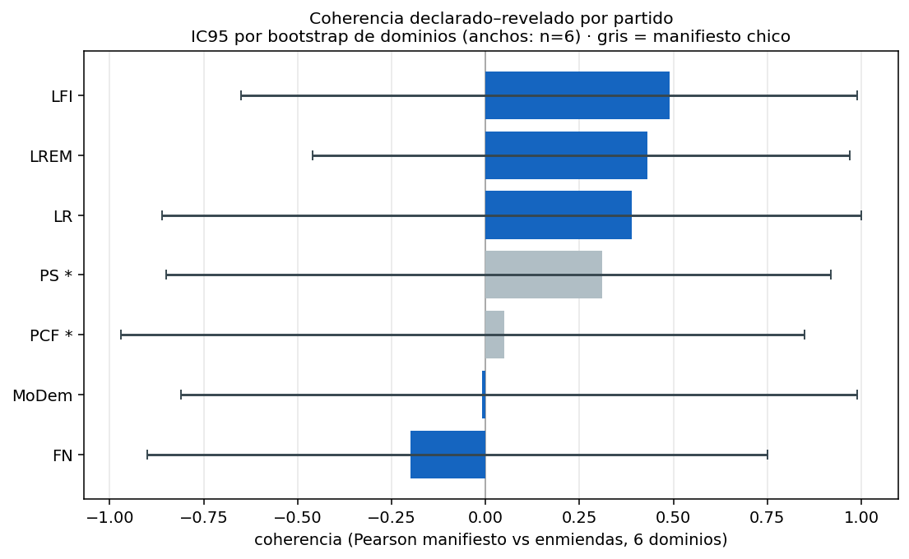
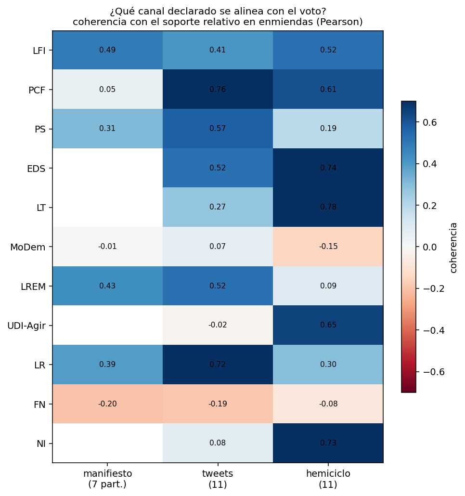

# Análisis 3 — ¿Votan lo que dicen? Agenda declarada vs. revelada

Los dos análisis anteriores miden cosas distintas de cada partido y nunca se habían cruzado. El **Análisis 1** (agenda *declarada*) mide **de qué habla** cada partido en sus manifiestos, tweets e intervenciones — el énfasis temático sobre los siete dominios MARPOR (*salience*). El **Análisis 2** (agenda *revelada*) mide **qué dominios reciben más o menos apoyo relativo** cuando los partidos votan enmiendas, neto de su tasa general de apoyo (su posición gobierno/oposición). Este tercer análisis los cruza: **¿coincide lo que un partido enfatiza con lo que apoya relativamente en el voto?** Más precisamente: ¿los dominios que un partido *sobre-enfatiza* son también los que apoya *relativamente por encima de su base* en enmiendas?

> **Tesis del capítulo.** La agenda declarada se **alinea solo débilmente** con el soporte relativo revelado por el voto: la relación no es lo bastante estable como para rankear partidos por "coherencia" ni para sostener que un canal anticipa mejor el voto. Pero la relación dicho–hecho **no es aleatoria**: aparece de forma **localizada** en banderas identitarias respaldadas, en distancias coherentes (no enfatizar y apoyar de menos) y en usos oposicionales de ciertos temas. El aporte principal es **tipológico**, no correlacional.

Por eso el capítulo tiene una jerarquía explícita de tres niveles:

1. **Resultado principal — la tipología por celda** (partido × dominio): en qué dominios la relación discurso–voto toma forma de *énfasis respaldado*, *énfasis no respaldado*, *apoyo no enfatizado* o *baja prioridad y menor apoyo relativo*.
2. **Resultado secundario — las correlaciones por partido son débiles e inestables** (se reportan con intervalos para mostrar su fragilidad, no para concluir).
3. **Resultado exploratorio — el canal casi no cambia la alineación** una vez igualada la cobertura de partidos.

---

## 1. Método

### 1.1 El problema: dos agendas que no son comparables en niveles

Las dos señales viven en unidades distintas y no se pueden restar. La declarada es un porcentaje de quasi-frases: siempre positiva y **sin dirección** (hablar mucho de seguridad no dice si se está a favor o en contra). La revelada es un soporte **signado**: tiene dirección. Por eso no comparamos niveles, sino **firmas relativas entre partidos** (distintividad), y usamos la **correlación** —invariante a escala— para medir si el patrón coincide:

- **Firma declarada** `s_decl[p,d]` = énfasis del partido *p* en el dominio *d* − promedio de ese dominio entre los partidos comparables (cuánto sobre/sub-enfatiza *d* respecto de sus pares, en pp).
- **Firma revelada** `s_rev[p,d]` = soporte relativo del Análisis 2 (soporte por tema − soporte global del partido, en pp).

Ambas son distintividad centrada: positivo = "más que el resto / más que mi base", negativo = "menos". Comparar sus signos por celda es interpretable directamente, y eso es el resultado central.

### 1.2 Qué significa (y qué no) un "soporte relativo negativo"

Esto es clave para no malinterpretar la tipología. El soporte relativo **no mide apoyo absoluto** al dominio, sino la **desviación respecto del comportamiento promedio del propio partido**. Un valor negativo **no significa** que el partido vote mayoritariamente `Contre`: significa que apoya ese dominio **menos que su tasa general** de apoyo a enmiendas.

El caso del eje cultural lo deja claro. En *Fabric of Society*, los apoyos **absolutos** de la izquierda siguen siendo mayoría:

| Partido | Apoyo global (todas las enmiendas) | Apoyo absoluto en *Fabric of Society* | Soporte **relativo** |
|---|---:|---:|---:|
| PS | ~83% | **60.8%** | −21.9 |
| LFI | ~84% | **67.8%** | −15.9 |
| PCF/GDR | ~87% | **69.5%** | −17.5 |

La izquierda **sigue votando Pour en mayoría** las enmiendas culturales; lo que hace es apoyarlas ~16–22 pp **por debajo de su altísima base**. Por eso en todo el documento se evita "vota en contra" / "rechaza" para describir soporte relativo negativo, y se usa "**apoya relativamente menos**" o "**se ubica por debajo de su base de apoyo**". (Se reserva la idea de rechazo absoluto para casos donde el apoyo absoluto también es bajo — típicamente el gobierno, que bloquea enmiendas: LREM apoya ~16% global.)

La simetría opera al revés en el bloque gubernamental: **MoDem apoya solo el 27.9% de las enmiendas económicas, pero como su base global ronda el 22%, ese dominio aparece con apoyo relativo *positivo* (+5.5).** El signo es siempre respecto de la base del propio partido, nunca un nivel absoluto.

### 1.3 Por qué dominios y no las 56 categorías

El análisis se mantiene a nivel de los **7 (→6) dominios** y no de las 56 categorías por una decisión, no solo por limitación: la unidad revelada —enmiendas votadas— no tiene densidad para estimar un soporte relativo estable en 56 categorías (muchas quedarían con poquísimas enmiendas, dominadas por el ruido del clasificador y por el leverage de categorías raras). Bajar a categorías ganaría granularidad a costa de robustez y comparabilidad. Los dominios sacrifican detalle pero preservan estabilidad.

### 1.4 Cobertura de partidos

El manifiesto se indexa por *partido electoral* (2017) y el voto por *grupo parlamentario* (XV legislatura); coinciden limpiamente **7 partidos** (LFI, PS, PCF, MoDem, LREM, LR y **FN**, que tiene manifiesto 2017 propio con 274 cuasi-frases). Tweets y hemiciclo usan la misma consolidación de grupos que el voto, así que ahí se comparan **11 familias**. **`FN` entra ahora como familia analítica separada en los tres cruces** (manifiesto-voto, tweets-voto, hemiciclo-voto); **`NI` queda como residuo heterogéneo de no-inscritos y no debe leerse como proxy de FN/RN** (de hecho ya no aparece en el cruce del manifiesto, porque no es un partido electoral 2017). El conjunto comparable principal pasó así de **6 a 7 partidos**, lo que **recentra todas las firmas declaradas** (`s_decl` se mide contra el promedio de los comparables, ahora incluido FN) y recalibra las correlaciones.

### 1.5 Por qué la correlación por partido es secundaria

Se excluye *External Relations* del análisis principal (bajísimo leverage en el voto: 5 leyes / 16 enmiendas, ver Análisis 2), de modo que la correlación de cada partido se calcula sobre **6 dominios**. Con seis puntos, el coeficiente es **muy ruidoso**: por diseño se reporta como resumen descriptivo, no como estimador estable de "coherencia partidaria", y el peso interpretativo recae en la tipología por celda (que no depende del coeficiente frágil).

### 1.6 Alcance del análisis

El análisis **no prueba cumplimiento programático ni causalidad** entre discurso y voto, ni evalúa si una enmienda concreta corresponde al contenido normativo que el partido defendía discursivamente. Compara **patrones agregados de prioridad temática y de apoyo relativo por dominio**. Por tanto, debe leerse como una **cartografía de alineaciones y brechas temáticas**, no como un test de consistencia ideológica individual.

---

## 2. Resultado principal — La tipología

Cruzando el signo de la firma declarada con el de la revelada, cada celda (partido × dominio) cae en un tipo. La tabla usa nombres **descriptivos** (no normativos); la lectura política viene después.

| | **Soporte relativo +** (apoya por encima de su base) | **Soporte relativo −** (por debajo de su base) |
|---|---|---|
| **Énfasis +** (habla más que sus pares) | **énfasis respaldado** | **énfasis no respaldado** |
| **Énfasis −** (habla menos) | **apoyo no enfatizado** | **baja prioridad y menor apoyo relativo** |


### 2.1 Dos formas de coherencia: afirmativa y negativa

La coherencia dicho–hecho puede tomar dos formas. La **coherencia afirmativa**: el partido enfatiza un dominio y lo apoya relativamente más (cuadrante *énfasis respaldado*). Y la **coherencia negativa**: el partido no enfatiza un dominio y además lo apoya relativamente menos (cuadrante *baja prioridad y menor apoyo relativo*). La segunda es tan informativa como la primera: una distancia sostenida en discurso *y* voto es tan coherente como una bandera. Distinguirlas evita asociar "coherencia" solo con el cuadrante arriba-derecha.

### 2.2 Coherencia afirmativa: las banderas respaldadas

Casos donde la identidad del partido se sostiene del discurso al voto, en sus temas propios:

- **LFI ↔ Libertades** (*Freedom & Democracy*): soporte relativo **+6.9** (apoyo absoluto 90.6%, base ~84%), con énfasis positivo en manifiesto (+2.1) y no-negativo en los tres canales. Su bandera de derechos civiles es afirmativa.
- **PS ↔ Bienestar**: énfasis fuerte en manifiesto (+13.1) y soporte relativo +3.6 (apoyo 86.3%). Su programa social, dicho y votado.
- **Eco-izquierda (EDS, LT) ↔ Bienestar/Economía** y **bloque gubernamental centrista (LREM, MoDem) ↔ Economía**: énfasis respaldado en sus respectivos núcleos (ver tabla de casos).

### 2.3 Coherencia negativa: el eje cultural y la izquierda

El hallazgo más robusto. En *Fabric of Society* (identidad, seguridad, nación) la izquierda **no se apropia discursivamente del eje y a la vez lo apoya relativamente menos** que cualquier otro tema:

- **El énfasis positivo está ausente en las 9 combinaciones partido-canal de la izquierda** (LFI, PCF, PS × manifiesto/tweets/hemiciclo): cero celdas con sobre-énfasis; **PCF y PS lo sub-enfatizan en los 3 canales** y LFI en 2 de 3.
- El soporte relativo es fuertemente negativo (PS −21.9, PCF −17.5, LFI −15.9) — aunque, como se aclaró, el apoyo absoluto sigue siendo mayoría (60–69%).

El clivaje cultural del Análisis 2 aparece así como **coherencia negativa**: no una bandera que se proclama y se vota, sino un eje del que la izquierda se distancia tanto en discurso como en voto. Es el caso más limpio del capítulo, y cae en el cuadrante abajo-izquierda — de ahí la importancia de teorizar la coherencia negativa.

> **Nota sobre PS (recalibrada con FN).** Al incluir FN —que sobre-enfatiza fuertemente *Fabric of Society* (+9.8 en manifiesto)— en el centrado del énfasis, la firma declarada de PS en ese dominio pasa de ~0 a **−1.6** (sub-énfasis leve pero ya del lado negativo en los 3 canales). El patrón de PS deja de ser "neutro" y se suma limpiamente a la coherencia negativa de la izquierda: **ausencia de apropiación discursiva positiva combinada con un soporte relativo claramente negativo** (−21.9).

### 2.4 Énfasis no respaldado: el uso oposicional de un tema

Casos donde el partido **enfatiza un tema pero su soporte relativo es negativo**. Sustantivamente, cuando el contexto político lo indica, esto se lee como **bandera de ataque** — el dominio se usa para confrontar, no para legislar a favor:

- **LR ↔ Fabric of Society**: lo enfatiza en 2 de 3 canales (su *issue ownership* securitario; +2.4 en manifiesto, +1.1 en tweets), pero su soporte relativo es −4.7. El tema es más discursivo que respaldado en enmiendas.
- **FN ↔ Fabric of Society**: el caso más nítido del cuadrante (ver bloque dedicado en §2.5). FN enfatiza fuertemente su firma nacional-securitaria en los **3 canales** (manifiesto +9.8, sign-stable 3/3), pero en el voto su soporte a enmiendas de *Fabric of Society* **no es distintivo** (−1.0, no robusto): su bandera identitaria es discursiva, no se traduce en apoyo relativo en enmiendas.

> **Cautela.** El caso PCF–*Sistema Político* en manifiesto (+11.5 declarado, −2.9 relativo) caería acá, pero el +11.5 proviene del énfasis en *Autoridad Política* (cat. 305) que el README marca como **ruido de muestra chica** (PCF: 39 frases). No conviene leerlo como énfasis oposicional real.

### 2.5 FN: la firma declarada que el voto no respalda

FN es el caso más ilustrativo del **gap declarado–revelado**, y conviene leerlo como **diferencia entre capas observables**, no como incoherencia normativa ni hipocresía. Sus celdas (manifiesto; el soporte revelado es el mismo en los tres canales porque viene del voto):

| Dominio | s_decl (manif.) | s_rev | Apoyo abs. | Tipo | Robustez revelado |
|---|---:|---:|---:|---|---|
| *Fabric of Society* | **+9.8** | −1.0 | 72.4 | énfasis no respaldado / neutro | no robusto (estab. 0.54) |
| *Welfare & QoL* | −1.5 | **+14.0** | 87.4 | apoyo no enfatizado | robusto (estab. 1.00) |
| *Freedom & Democracy* | −1.8 | **−19.2** | 54.2 | baja prioridad y menor apoyo relativo | robusto (estab. 1.00) |
| Economy | +3.7 | −24.9 | 48.5 | énfasis no respaldado | **no interpretable** (IC [−54.4, +7.0]) |
| Social Groups | −3.7 | +2.8 | 76.2 | apoyo no enfatizado | no robusto |
| Political System | −6.1 | −2.3 | 71.1 | baja prioridad y menor apoyo relativo | no robusto |

Tres lecturas, todas con el cuidado del §1.2 (soporte relativo ≠ apoyo absoluto):

- **Su bandera identitaria es declarada, no revelada.** FN sobre-enfatiza *Fabric of Society* en los **3 canales** (núcleo persistente del Análisis 1: `601 National Way of Life`, `605 Law and Order`, `608 Multiculturalism negative`), pero su voto sobre enmiendas de ese dominio **no se aparta de su base** (−1.0, no robusto). Es la versión más pura de "énfasis no respaldado": el tema propio se proclama pero no genera un patrón de apoyo distintivo en el voto.
- **Revela apoyo donde no enfatiza.** En *Welfare & QoL* FN apoya **+14.0 pp por encima de su base** (apoyo absoluto 87.4%, el más alto de cualquier partido en ese dominio; estab. 1.00), pese a sub-enfatizarlo discursivamente en los 3 canales. Es "apoyo no enfatizado".
- **Se distancia de libertades en el voto.** En *Freedom & Democracy* su soporte relativo es **−19.2** (estab. 1.00), empatado con LR como polo derecho del clivaje cultural (Análisis 2) — pero **sigue votando Pour en mayoría (54.2%)**: es apoyo por debajo de su base, no rechazo absoluto. Su énfasis declarado en ese dominio es bajo/mixto, así que en el voto cae como "baja prioridad y menor apoyo relativo".

Coherentemente con este desfase entre capas, la **correlación declarado–revelado de FN es la más baja del conjunto** (Pearson −0.20, re-centrado −0.00), pero su IC95 [−0.90, 0.75] cubre casi todo el rango: **no es distinguible de cero ni de los demás**, así que no debe leerse como "el partido menos coherente" (ver §3). *External Relations* no tiene cobertura estimable para FN y no se interpreta. *Economy* se descarta por IC enorme.

### 2.6 Robustez de la tipología

**Umbral de signo.** La clasificación por signo puede ser sensible a valores casi nulos (p. ej. FN en *Fabric of Society* revelado −1.0, o LR en *Sistema Político* +0.1). Reclasificando con una **zona neutra de ±1 pp** (positivo si >+1, negativo si <−1, neutro en el medio): **ninguna celda cambia de cuadrante** (0% de inversiones); solo pasan a "neutro" el 24% de las celdas del manifiesto (43% en todos los canales, donde el centrado comprime más el énfasis). Es decir, los patrones direccionales **no se invierten**: los casos chicos simplemente dejan de calificar. Los hallazgos sustantivos (banderas respaldadas, coherencia negativa cultural, énfasis oposicional de LR, gap declarado–revelado de FN) sobreviven al umbral.

**Estabilidad entre canales.** Para cada celda se cuenta en cuántos canales el énfasis declarado tiene el mismo signo (`cross_channel_sign_stability.csv`). Esto refuerza que los patrones no son accidente de un canal — p. ej. la ausencia de apropiación cultural de la izquierda y la sub-enfatización de *Bienestar* por LR (3/3 canales). *Caveat:* el manifiesto es otra unidad y otro período, así que el acuerdo de signo manifiesto–tweets es **convergencia entre actos comunicativos distintos**, no robustez muestral en sentido estricto.

### 2.7 Casos canónicos

Las celdas que sostienen la interpretación (declarado y revelado en pp; apoyo absoluto y base global en %):

| Partido | Dominio | s_decl | s_rev | Apoyo abs. | Base global | Tipo | Lectura |
|---|---|---:|---:|---:|---:|---|---|
| LFI | Libertades | +2.1 | +6.9 | 90.6 | ~84 | énfasis respaldado | derechos civiles como bandera afirmativa |
| PS | Bienestar | +13.1 | +3.6 | 86.3 | ~83 | énfasis respaldado | bienestar social, dicho y votado |
| MoDem | Economía | +1.9 | +5.5 | 27.9 | ~22 | énfasis respaldado | gestión económica del centro |
| PCF | *Fabric of Society* | −4.0 | −17.5 | 69.5 | ~87 | baja prioridad y menor apoyo relativo | distancia cultural sostenida (sub-énfasis 3/3 canales) |
| LFI | *Fabric of Society* | −4.5 | −15.9 | 67.8 | ~84 | baja prioridad y menor apoyo relativo | distancia del eje identitario (sigue apoyando 68%) |
| PS | *Fabric of Society* | −1.6 | −21.9 | 60.8 | ~83 | baja prioridad y menor apoyo relativo | sub-énfasis leve + soporte relativo muy negativo |
| LR | *Fabric of Society* | +2.4 | −4.7 | 66.2 | ~71 | énfasis no respaldado | issue ownership securitario más discursivo que votado |
| **FN** | *Fabric of Society* | **+9.8** | −1.0 | 72.4 | ~73 | énfasis no respaldado / neutro | firma nacional-securitaria declarada, no distintiva en el voto |
| **FN** | Bienestar | −1.5 | **+14.0** | 87.4 | ~73 | apoyo no enfatizado | apoya protección social sin declararla |
| **FN** | Libertades | −1.8 | **−19.2** | 54.2 | ~73 | baja prioridad y menor apoyo relativo | vota libertades por debajo de su base (sigue 54% Pour) |
| EDS | Economía (tweets) | −0.0 | +23.6 | 59.9 | ~36 | apoyo no enfatizado | fuerte apoyo económico, poco central en su comunicación |

> La fila MoDem ilustra §1.2: un apoyo absoluto de 27.9% puede ser **énfasis respaldado** porque está *por encima* de su base (~22%) — el gobierno bloquea enmiendas en general, así que su señal temática es enteramente relativa.

---

## 3. Resultado secundario — Coherencia por partido (débil e inestable)

La correlación de la firma declarada con la revelada, por partido, sobre 6 dominios:



| Partido | Pearson | Spearman | Pearson (re-centrado) | IC95 (bootstrap dominios) |
|---|---:|---:|---:|---|
| LFI | 0.49 | 0.31 | 0.47 | [−0.65, 0.99] |
| LREM | 0.43 | 0.38 | −0.10 | [−0.46, 0.97] |
| LR | 0.39 | 0.26 | 0.42 | [−0.86, 1.00] |
| PS * | 0.31 | 0.09 | 0.07 | [−0.85, 0.92] |
| PCF * | 0.05 | −0.14 | 0.21 | [−0.97, 0.85] |
| MoDem | −0.01 | −0.14 | −0.17 | [−0.81, 0.99] |
| FN | −0.20 | −0.09 | −0.00 | [−0.90, 0.75] |

`*` manifiesto de muestra chica (PCF 39, PS 79 frases). FN tiene manifiesto de tamaño suficiente (274 cuasi-frases), así que su bajo coeficiente **no es un artefacto de muestra**, sino reflejo del gap declarado–revelado descrito en §2.5.

**No se puede rankear a los partidos por coherencia.** Los intervalos cubren casi todo [−1, +1] para *todos* (incluida FN: [−0.90, 0.75]): ningún coeficiente es distinguible de cero ni de los demás. La inestabilidad entre Pearson, Spearman y la variante re-centrada (LREM pasa de 0.43 a −0.10; LFI de 0.49 a 0.47 pero PCF de 0.05 a 0.21; FN de −0.20 a −0.00) confirma lo mismo. **Que FN aparezca último en Pearson no autoriza a llamarlo "el menos coherente"**: con seis dominios y un IC que cruza el cero, el orden es ruido.

> Estos intervalos **no deben leerse como inferencia estadística fuerte**, sino como una **visualización de la sensibilidad** del coeficiente a la composición temática. Con solo seis dominios, el bootstrap por dominios muestra que el ranking es inestable — es una demostración de fragilidad, no un intervalo inferencial robusto.

---

## 4. Resultado exploratorio — ¿Qué canal se alinea con el voto?

Coherencia (Pearson) de cada canal con el soporte relativo en enmiendas, por partido:



A primera vista, hemiciclo (pooled 0.29) y tweets (0.18) parecen alinearse mejor que el manifiesto (0.08). Pero la comparación no es justa: el manifiesto solo cubre 7 partidos y los otros 11, y más partidos = más rango ideológico = correlación más alta. **Igualando los tres canales a los mismos 7 partidos comparables (incluida FN):**

| Canal | Pooled (todos) | Pooled (7 partidos, comparación justa) |
|---|---:|---:|
| manifiesto | 0.08 (n=7) | **0.08** |
| tweets | 0.18 (n=11) | **0.08** |
| hemiciclo | 0.29 (n=11) | **0.16** |

Con la misma base, los tres canales quedan **parejos y débiles** (0.08–0.16). La aparente superioridad del hemiciclo era casi todo artefacto de cobertura. Conclusión: **ningún canal "anticipa" el voto de forma sustantivamente mejor que otro** una vez igualada la cobertura; la alineación es débil-positiva en todos. Incluir FN **recalibra los niveles hacia abajo** (la firma identitaria declarada de FN no se respalda en el voto, lo que baja el pooled) pero **no cambia la conclusión**.

---

## 5. Síntesis

La agenda declarada se alinea solo débilmente con la revelada: la relación **no permite inferir de forma estable** qué dominios recibirán mayor apoyo relativo, ni rankear partidos, ni coronar un canal. Pero **no es aleatoria** — adopta formas sistemáticas y localizadas:

- **Banderas respaldadas** (coherencia afirmativa): LFI↔libertades, PS↔bienestar, eco-izquierda (EDS, LT)↔bienestar/economía, bloque gubernamental centrista (LREM, MoDem)↔economía. La identidad temática se sostiene del discurso al voto en los temas propios.
- **Coherencia negativa en el eje cultural:** la izquierda no se apropia discursivamente de *Fabric of Society* (énfasis positivo ausente en sus 9 combinaciones partido-canal; PCF y PS lo sub-enfatizan en los 3 canales) y lo apoya relativamente menos — aunque siga aprobándolo en mayoría absoluta. Es el patrón más limpio del capítulo.
- **Énfasis no respaldado:** LR enfatiza cultura/seguridad pero la apoya por debajo de su base. **FN es el caso extremo del gap:** declara una firma nacional-securitaria persistente en los 3 canales (*Fabric of Society*) que en el voto **no es distintiva** (−1.0), mientras revela —sin declararlo— apoyo a *Welfare & QoL* (+14.0) y un soporte relativo negativo robusto en *Freedom & Democracy* (−19.2). No es incoherencia normativa, sino **diferencia entre capas observables**: lo que FN proclama como identidad y lo que su voto distingue no coinciden.

El gap declarado–revelado no es incoherencia global: la coherencia se **concentra en las banderas de identidad** y se diluye o se desplaza de dominio en los temas usados instrumentalmente. Esto cierra el arco de la tesis: el voto tiene una capa **posicional** (gobierno/oposición, Análisis 2), una capa **ideológica** que aflora en enmiendas (el clivaje cultural, donde FN y LR forman el polo derecho), y una relación **parcial y localizada** con la agenda declarada. La separación de FN respecto de `NI` permite ver este desfase con claridad: antes la señal estaba diluida en un agregado residual.

---

## 6. Caveats

- **n = 6 dominios** limita las correlaciones por partido (ver §1.5); el peso está en la tipología.
- **Manifiesto: 7 partidos y muestras chicas.** PCF (39) y PS (79 frases) tienen firmas declaradas poco robustas; sus celdas son indicativas. FN tiene manifiesto de tamaño suficiente (274 cuasi-frases).
- **FN es una familia analítica de base parlamentaria pequeña** (11 diputados identificados por `deputy_id`). Su lado revelado descansa en n=95 scrutins de leyes y n=319 de enmiendas; pasa el filtro `MIN_EXPRESSED=3`, pero sus celdas por dominio se leen con el IC en la mano: *Welfare & QoL* (+14.0) y *Freedom & Democracy* (−19.2) son robustas (estab. 1.00); *Economy* (−24.9, IC [−54.4, +7.0]) y *Fabric of Society* revelado (−1.0) **no lo son**, y *External Relations* no tiene cobertura.
- **Composición de FN.** Agrupa a los diputados electos 2017 bajo bandera FN/RN, sus suplentes y a Emmanuelle Ménard (apparentée); es una **decisión analítica** documentada, no una etiqueta oficial de grupo parlamentario.
- **`NI` es un residuo heterogéneo** (8 no-inscritos), **no un proxy de FN/RN**. No aparece en el cruce del manifiesto y sus celdas reveladas tienen muestra muy chica e IC anchos (p. ej. *Political System* −49.7): no debe leerse como un partido ideológico coherente.
- **Soporte relativo ≠ apoyo absoluto** (§1.2): toda lectura de la firma revelada es relativa a la base del partido. Vale para FN: su −19.2 en *Libertades* convive con 54.2% de apoyo absoluto (mayoría Pour), no es rechazo absoluto.
- **Correlaciones con IC amplios:** los coeficientes por partido (incluida FN) tienen IC que cruzan el cero; no se rankea ni se moraliza la "coherencia".
- **Desfase temporal/organizacional:** el manifiesto es de campaña (2017, partido electoral); el voto, de la legislatura (grupo parlamentario). Tweets y hemiciclo son contemporáneos al voto.
- **External Relations** se excluye del análisis principal por bajo leverage; el pooled "con ExtRel" se reporta como sensibilidad (baja la coherencia en todos los canales, consistente con que es consenso transversal).
- **Sin causalidad:** no se afirma que el discurso cause el voto ni viceversa; solo se describe su grado y forma de alineación.

---

## 7. Reproducir

```bash
cd french_deputies/party_analysis
# requiere: numpy, pandas, scipy, matplotlib
# (usa los results/ de manifestos, tweets, interventions y amendements)
python3 -u declarado_vs_revelado/build.py 2>&1 | tee declarado_vs_revelado/results/run.log
```

**Salidas** (`declarado_vs_revelado/results/`):

| Archivo | Contenido |
|---|---|
| `declared_revealed_aligned.csv` | firma declarada/revelada, apoyo absoluto y global, tipo (por signo y con umbral ±1pp) por (canal, partido, dominio) |
| `quadrant_typology_manifesto.csv` | la tipología del manifiesto (resultado central) |
| `cross_channel_sign_stability.csv` | estabilidad del signo declarado entre canales por celda |
| `coherence_by_party_channel.csv` | Pearson/Spearman/re-centrado + IC95 (manifiesto) por partido y canal |
| `pooled_coherence.csv` | coherencia agregada por canal (todos vs. 7 partidos comparables; con/sin ExtRel) |
| `fig_quadrants_manifiesto.png` | tipología por partido (figura central) |
| `fig_coherence_ranking.png` | ranking de coherencia con IC95 (secundario) |
| `fig_coherence_by_channel.png` | matriz partido × canal de coherencia (exploratorio) |
| `summary.json` | resumen numérico |
